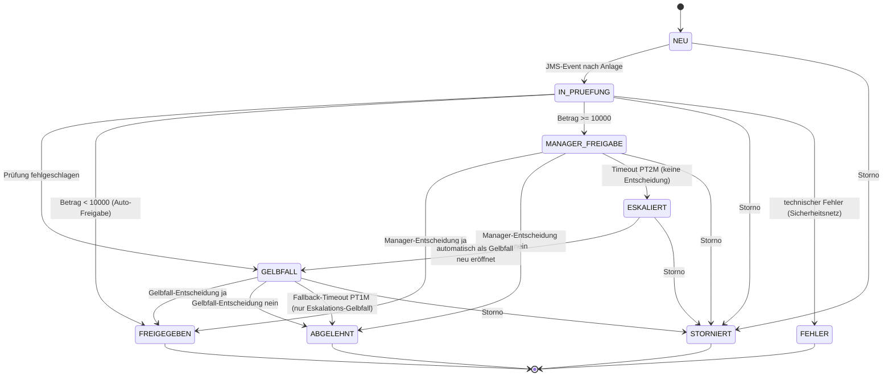

# jee-bpel-demo

Demo-Projekt zu einem sprachlich reichhaltigen BPEL-Prozess auf Apache ODE, eingebettet in
eine Jakarta-EE-Anwendung (WildFly): statt eines einzelnen `receive → invoke → reply`
orchestriert `BestellungFreigabeProcess` drei fachliche Freigabepfade (automatische Freigabe,
Gelbfallbearbeitung, Manager-Freigabe mit Eskalation) inklusive Korrelationssets,
`pick`/`onAlarm`, Kompensation und einem echten Abbruch-Pattern. Zeigt u. a. Jakarta EE 10,
JPA/Hibernate, CDI, EJB, JMS, REST- und SOAP-Webservices, Oracle/Criteria-API sowie BPEL auf
Apache ODE - siehe [docs/01-anforderungen.md](docs/01-anforderungen.md) für den fachlichen
Hintergrund.

Alles läuft lokal per Docker (WildFly, Apache ODE, Oracle Free), keine Lizenzkosten.

## Starten

```bash
cd docker
docker compose up -d --build   # bauen + starten
docker compose down            # stoppen (Daten bleiben erhalten)
docker compose down -v         # stoppen + Datenvolumen loeschen (kompletter Reset)
```

Der Compose-Stack hat einen expliziten Projektnamen (`name: jee-bpel-demo` in
`docker-compose.yml`), damit er nicht mit anderen lokalen Docker-Compose-Projekten
gleichen Ordnernamens kollidiert.

Nach einem `docker compose down -v` ist auch der Apache-ODE-Prozessspeicher weg (keine
laufenden Instanzen mehr) - wer also Datenmüll (verwaiste Freigabeaufgaben ohne passende
ODE-Instanz) beseitigen will, ist mit `down -v` + `up -d --build` immer auf der sicheren Seite.

## URLs im Überblick

| Was | URL | Methode |
|---|---|---|
| GUI: Neue Bestellung anlegen | http://localhost:9081/bestellung/neue-bestellung.xhtml | Browser |
| GUI: Bestellungen-Übersicht | http://localhost:9081/bestellung/bestellungen.xhtml | Browser |
| GUI: Gelbfallbearbeitung | http://localhost:9081/bestellung/gelbfall.xhtml | Browser |
| GUI: Manager-Freigabe | http://localhost:9081/bestellung/managerfreigabe.xhtml | Browser |
| REST: Bestellungen-Liste | http://localhost:9081/bestellung/api/bestellungen | GET |
| REST: Bestellung anlegen | http://localhost:9081/bestellung/api/bestellungen | POST (JSON) |
| REST: Bestellung korrigieren | http://localhost:9081/bestellung/api/bestellungen/{id} | PATCH (JSON: `betrag` und/oder `email`) |
| REST: Prozess starten | http://localhost:9081/bestellung/api/bestellungen/{id}/prozess/start | POST |
| REST: Prozess stornieren | http://localhost:9081/bestellung/api/bestellungen/{id}/prozess/stornieren | POST (JSON: `grund`) |
| REST: Gelbfall-Entscheidung | http://localhost:9081/bestellung/api/bestellungen/{id}/prozess/gelbfall-entscheidung | POST (JSON: `aufgabeId`,`freigegeben`,`kommentar`) |
| REST: Manager-Entscheidung | http://localhost:9081/bestellung/api/bestellungen/{id}/prozess/manager-entscheidung | POST (JSON: `aufgabeId`,`freigegeben`,`kommentar`) |
| REST: Offene Gelbfälle | http://localhost:9081/bestellung/api/freigabeaufgaben/gelbfall | GET |
| REST: Offene Manager-Freigaben | http://localhost:9081/bestellung/api/freigabeaufgaben/manager | GET |
| SOAP Prüfung (WSDL) | http://localhost:9081/bestellung-ejb/BestellungPruefungService/BestellungPruefungWebService?wsdl | GET |
| SOAP Gelbfall (WSDL) | http://localhost:9081/bestellung-ejb/GelbfallService/GelbfallWebService?wsdl | GET |
| SOAP Freigabe (WSDL) | http://localhost:9081/bestellung-ejb/BestellungFreigabeService/BestellungFreigabeWebService?wsdl | GET |
| BPEL-Prozessaufruf (ODE, direktes SOAP) | http://localhost:8181/ode/processes/BestellungFreigabeProcess | POST (SOAP) |
| ODE-Web-Konsole (Prozessliste) | http://localhost:8181/ode/#/processes | Browser |
| ODE-Web-Konsole (Instanzen) | http://localhost:8181/ode/#/instances?q= | Browser |
| Oracle-DB (JDBC) | `jdbc:oracle:thin:@localhost:1522/FREEPDB1` (User `bestellung`/`bestellung`) | JDBC |

Drei Zugriffsarten auf den Prozess sind möglich: **GUI** (JSF ruft die REST-Fassade), **REST**
(dieselbe Fassade, direkt per curl/Postman) und **direktes SOAP** gegen den ODE-Endpunkt
(Contract: `bestellung-bpel/src/main/bpel/BestellungFreigabeProcess.wsdl`).

## Statusfluss (`BestellungStatus`)



`IN_PRUEFUNG` heißt "wartet auf Prozessstart", nicht "wird gerade geprüft" - die eigentliche
Prüfung (`PruefungService`) läuft erst, wenn im BPEL-Prozess der Schritt `pruefeBestellung`
aufgerufen wird (ausgelöst durch "Prozess starten").

## Use Cases

### 1. Neue Bestellung anlegen → automatisch in der Übersicht sehen

`neue-bestellung.xhtml` ist eine eigene Seite (eigener Sidebar-Menüpunkt "Neue Bestellung").
Nach dem Klick auf "Anlegen" leitet die GUI automatisch auf `bestellungen.xhtml` weiter, die
neue Bestellung ist dort sofort in der Tabelle sichtbar (Status kurz `NEU`, dann quasi sofort
`IN_PRUEFUNG` über ein JMS-Event von `BestellungEventProducer`/`BestellungEventConsumer`,
Queue `OrderEventsQueue`).

### 2. Prozess starten vs. Stornieren

Beide Aktionen stehen in der Bestellungen-Tabelle, aber nur passend zum aktuellen Status:

- **Prozess starten**: nur bei `NEU`/`IN_PRUEFUNG` (noch keine ODE-Instanz vorhanden)
- **Stornieren**: nur bei `MANAGER_FREIGABE`/`ESKALIERT` (Instanz läuft aktiv und wartet -
  ein Klick vor dem Prozessstart scheitert mit HTTP 409, da keine Instanz zum Korrelieren
  existiert)
- Bei `GELBFALL` erscheint stattdessen ein "Gelbfallbearbeitung"-Button, der auf
  `gelbfall.xhtml` verweist
- Bei Endstatus (`FREIGEGEBEN`/`ABGELEHNT`/`STORNIERT`/`FEHLER`) ist keiner der Buttons mehr
  sinnvoll und wird nicht angezeigt

Da der REST-Aufruf nur auf die sofortige BPEL-Ack-Reply wartet (die eigentliche
Statusänderung läuft in ODE asynchron weiter, typischerweise < 1s), merkt sich die GUI
session-lokal, dass eine Aktion pro Bestellung bereits ausgelöst wurde, und blendet den
Button sofort aus - unabhängig davon, ob der Status das schon widerspiegelt. Verhindert
doppelte Prozessstarts durch Mehrfachklicks.

### 3. Gelbfallbearbeitung inkl. Korrektur-Dialog

Eine Bestellung landet im Gelbfall, wenn `PruefungService` sie ablehnt: `UNGUELTIGER_BETRAG`
(≤ 0) oder `UNGUELTIGE_MAIL_ADRESSE` (Regex-Prüfung). In `gelbfall.xhtml` ist der
Freigeben-Button für diese beiden Gründe deaktiviert - stattdessen erscheint ein
"Bearbeiten"-Button:

1. Öffnet einen Dialog mit Firma/Email/Betrag (nur das laut Grund tatsächlich ungültige
   Feld ist editierbar, mit serverseitiger Validierung: Betrag > 0, Email-Regex)
2. "Speichern" korrigiert die Bestellung direkt per REST-PATCH (ohne den BPEL-Prozess zu
   berühren - die Instanz wartet weiterhin unverändert im selben `pick`)
3. Der korrigierte Wert wird grün markiert, "Freigeben" erscheint wieder, "Bearbeiten"
   verschwindet

### 4. Manager-Freigabe mit Eskalation (Vier-Augen-Prinzip)

Bestellungen mit Betrag ≥ 10000 gehen in `MANAGER_FREIGABE`. Trifft innerhalb von **2 Minuten**
(`onAlarm PT2M`) keine Entscheidung ein, eskaliert der Prozess automatisch: Status
`ESKALIERT`, die Bestellung wird als neuer Gelbfall eröffnet (Grund
"Manager-Freigabe-Timeout - eskaliert"). Trifft auch dort innerhalb von **1 Minute**
(`onAlarm PT1M`, Fallback) keine Entscheidung ein, wird die Bestellung automatisch
`ABGELEHNT` - und die zugehörige Freigabeaufgabe wird von der BPEL-Instanz selbst korrekt
geschlossen (`gelbfallPartner.gelbfallSchliessen`), damit sie nicht als "ewig offen" in der
GUI hängen bleibt.

### 5. Storno

Funktioniert nur, während eine BPEL-Instanz aktiv läuft (`eventHandlers`/Fault-Pattern,
funktioniert auch mitten in einem offenen `pick`). Setzt den Status auf `STORNIERT` und löst
die Kompensation einer eventuell bereits erteilten Freigabe aus.

## Apache-ODE-Konsole

Die Konsole unter `http://localhost:8181/ode/` spricht ausschließlich mit ODE selbst
(PMAPI/IMAPI per SOAP) - sie kennt weder die Oracle-DB noch die WildFly-Fachlogik. Sie zeigt
also nur, was der BPEL-Prozess gerade tut, nicht den fachlichen Bestellstatus.

**Dashboard (`#/`)**: Kacheln mit Gesamtzahlen - Process Packages, Process Models, Process
Instances, sowie Active/Suspended/Completed/Failed/Terminated Instances (jede Kachel
verlinkt direkt auf die entsprechend gefilterte Instanzliste).

**Prozessliste (`#/processes`)**: alle deployten Prozesspakete/-versionen
(`BestellungFreigabeProcess`) mit Instanzzähler pro Status. Von hier aus lässt sich ein
Prozess **retire/activate** (keine neuen Instanzen mehr annehmen bzw. wieder erlauben) oder
ein neues Prozess-Package per Zip-Upload **deployen**. Klick auf einen Prozess zeigt dessen
WSDL-Endpunkte und die letzten Instanzen dieses Prozesses.

**Instanzliste (`#/instances?q=...`)**: alle Prozessinstanzen, filterbar per Query (z. B.
`status = active`, `status = completed`, oder nach Korrelationswert). Zeigt Status, Start-/
Letzte-Aktivität-Zeit und Korrelationseigenschaften (z. B. `bestellungIdProperty`) - darüber
lässt sich eine Instanz einer konkreten Bestellungs-ID zuordnen. Mehrfachauswahl erlaubt
**Terminate/Suspend/Resume/Delete**.

**Instanzdetail (`#/instances/{iid}`)**: der eigentliche Mehrwert für Debugging - zeigt den
kompletten Scope-Baum mit allen Activities (inkl. Status "waiting" für eine gerade offene
`pick`), alle Variablenwerte (inklusive Bearbeiten per **Set Variable**, nützlich um einen
haengenden Prozess manuell zu korrigieren), Endpoints, und bei einem Fault die genaue
Fehlermeldung/Zeile. Fehlgeschlagene Activities lassen sich hier gezielt **retry/cancel/
recover**.

Kurz: Man sieht hier live, in welcher Aktivität (z. B. welchem `pick`) eine Instanz gerade
hängt und wie lange schon - genau das, was wir in dieser Session mehrfach genutzt haben, um
Timeouts (`onAlarm PT2M`/`PT1M`) und hängende Korrelationen zu verifizieren. Verändern
(Freigeben/Ablehnen) sollte man eine Bestellung aber immer über die GUI/REST-Fassade, nicht
über die ODE-Konsole - sonst bleibt der fachliche Status in der Oracle-DB inkonsistent.

## Bekannte Demo-Einschränkung

Apache ODE hält seinen Instanzspeicher nur im Container (kein persistentes Volume). Ein
`docker compose up -d --build ode` (oder ein Rebuild, das den ODE-Container neu erstellt)
setzt alle laufenden BPEL-Instanzen zurück, während die Oracle-DB (Bestellungen,
Freigabeaufgaben) unverändert bleibt. Dadurch können Freigabeaufgaben entstehen, deren
ODE-Instanz nicht mehr existiert - ein Klick auf Freigeben/Ablehnen/Stornieren schlägt dann
mit HTTP 409 fehl ("Instanz wartet vermutlich nicht mehr"). Abhilfe: `docker compose down -v`
für einen kompletten, sauberen Neustart.

## Modulstruktur

```
jee-bpel-demo/
├── pom.xml
├── bestellung-ejb/     (Entities, Repository, Services, 3 SOAP-Endpoints, JMS)
├── bestellung-web/     (REST-Fassade Richtung ODE + JSF/PrimeFaces-GUI)
├── bestellung-ear/     (EAR: verpackt ejb+web)
├── bestellung-bpel/    (WSDLs + BestellungFreigabeProcess.bpel + deploy.xml)
├── bestellung-it/      (Integrationstests, nicht im Standard-Reactor)
├── docker/              (docker-compose.yml, wildfly/, ode/)
└── docs/                (Anforderungen, Architektur-Detaildoku)
```

Ausführliche Architektur-/Testprotokoll-Doku: [docs/02-architektur.md](docs/02-architektur.md).
