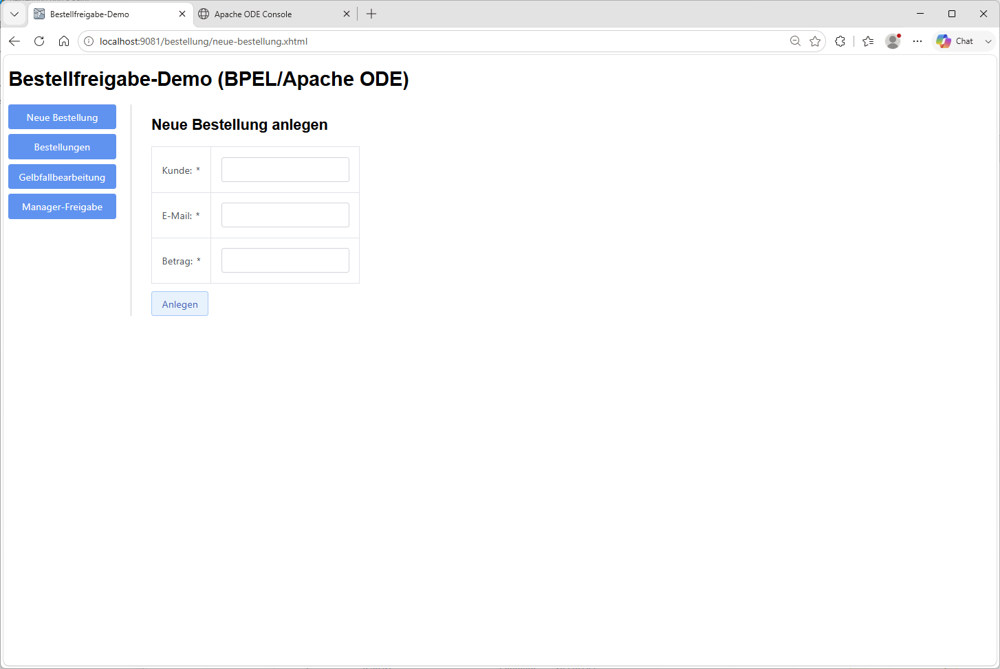
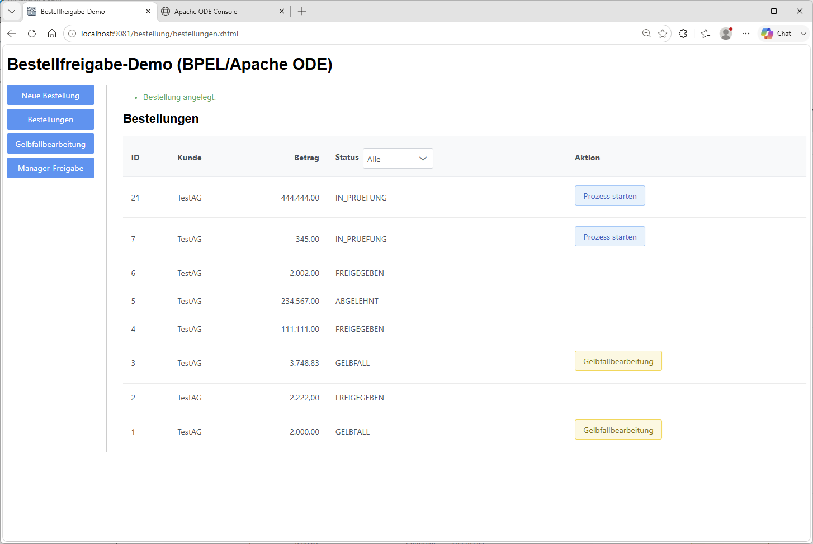
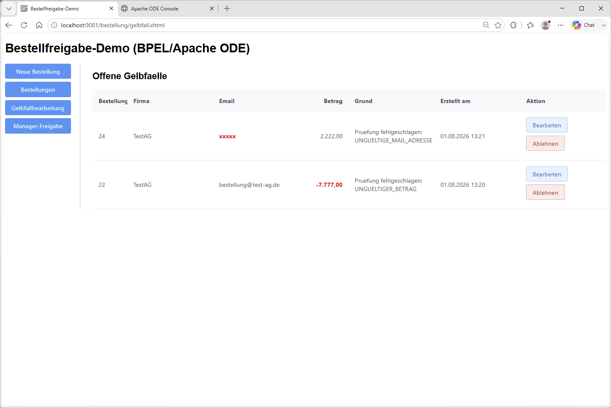
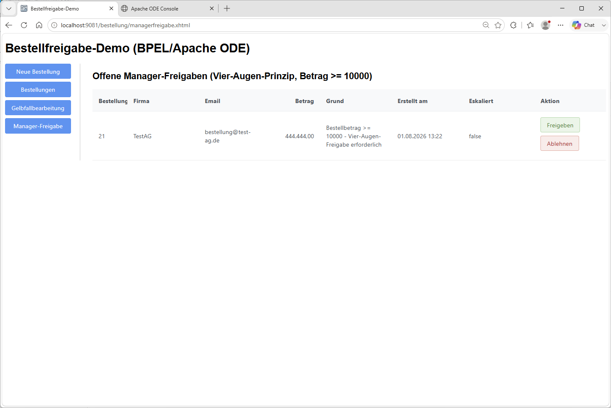
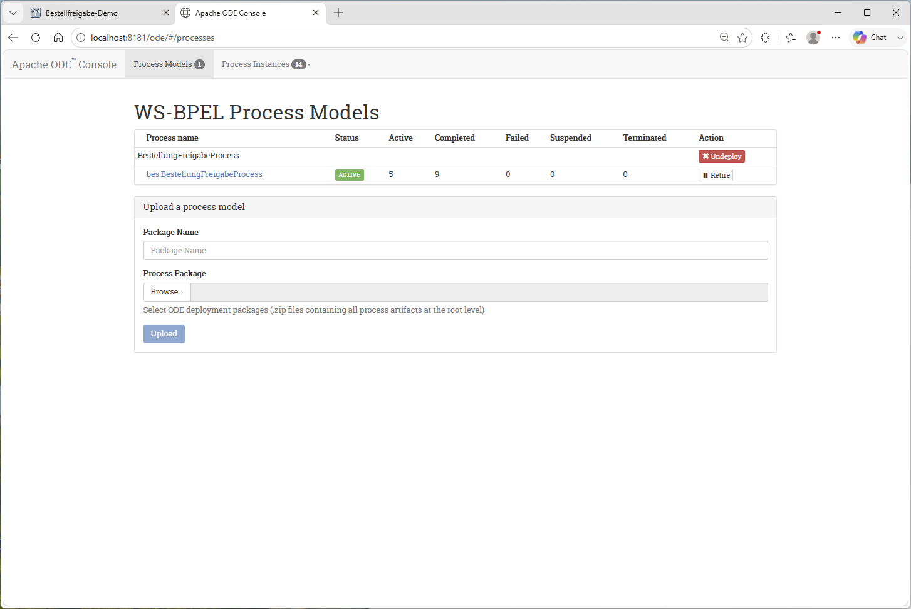

# Benutzeranleitung: Bestellfreigabe-Demo

Kurzer Rundgang durch die GUI (`http://localhost:9081/bestellung/`). Voraussetzung: der
Docker-Stack läuft (`cd docker && docker compose up -d --build`, siehe
[02-architektur.md](02-architektur.md)).

## 1. Neue Bestellung anlegen

Über den Menüpunkt **Neue Bestellung** wird eine Bestellung mit Kunde, E-Mail und Betrag
erfasst. Pflichtfelder werden beim Absenden geprüft.

## 2. Bestellungen-Übersicht

Nach dem Anlegen landet man automatisch in der **Bestellungen**-Übersicht. Der Status-Filter
oben in der Spalte "Status" schränkt die Liste ein. Je nach Status bietet die Aktionsspalte
**Prozess starten** (löst die BPEL-Prüfung aus) oder **Gelbfallbearbeitung** an.

Die Prüfung entscheidet automatisch über den weiteren Weg:

- **Betrag gültig und < 10.000** → automatische Freigabe
- **Betrag oder E-Mail ungültig** → Gelbfallbearbeitung
- **Betrag >= 10.000** → Manager-Freigabe (Vier-Augen-Prinzip)

## 3. Gelbfallbearbeitung

Unter **Gelbfallbearbeitung** landen Bestellungen, deren Prüfung fehlgeschlagen ist (Grund
wird angezeigt, betroffenes Feld rot markiert). Über **Bearbeiten** lässt sich der ungültige
Wert korrigieren, danach ist **Freigeben** möglich; alternativ **Ablehnen**.

## 4. Manager-Freigabe

Bestellungen ab 10.000 warten hier auf eine manuelle Entscheidung (**Freigeben**/**Ablehnen**).
Wird zwei Minuten lang nicht entschieden, eskaliert der Prozess automatisch und öffnet
stattdessen einen Gelbfall.

## 5. Apache-ODE-Konsole (technischer Blick auf den BPEL-Prozess)

Unter `http://localhost:8181/ode/#/processes` zeigt die mitgelieferte ODE-Konsole das
deployte Prozessmodell (`BestellungFreigabeProcess`) sowie unter "Process Instances" alle
laufenden/abgeschlossenen Prozessinstanzen mit ihrem aktuellen Zustand.

Details zur Konsole (was sie zeigt, was sich dort tun lässt, bekannte Einschränkung durch den
nicht persistenten Instanzspeicher) stehen im [README.md](../README.md).

## Abkürzungen

| Abkürzung | Bedeutung |
|---|---|
| BPEL | Business Process Execution Language – Sprache zur Orchestrierung von Prozessschritten (hier: `BestellungFreigabeProcess`) |
| ODE | Apache Orchestration Director Engine – die BPEL-Engine, die den Prozess ausführt |
| GUI | Graphical User Interface – die im Browser bedienbare Oberfläche dieser Demo |
| JSF | Jakarta Server Faces – Java-Framework für die GUI, hier erweitert um PrimeFaces-Komponenten |
| REST | Representational State Transfer – die HTTP/JSON-Schnittstelle, über die die GUI mit dem Backend spricht |
| SOAP | Simple Object Access Protocol – XML-basiertes Protokoll, über das der BPEL-Prozess die Backend-Services aufruft |
| WSDL | Web Services Description Language – Vertragsbeschreibung eines SOAP-Services |
| Jakarta EE | Jakarta Enterprise Edition (frühere Bezeichnung: Java EE) – der Anwendungsserver-Standard, auf dem das Backend läuft (WildFly) |
| DB | Datenbank – hier Oracle, enthält Bestellungen, Kunden und offene Freigabeaufgaben |
