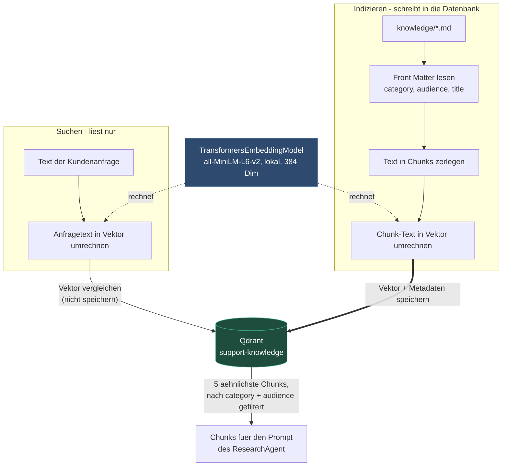
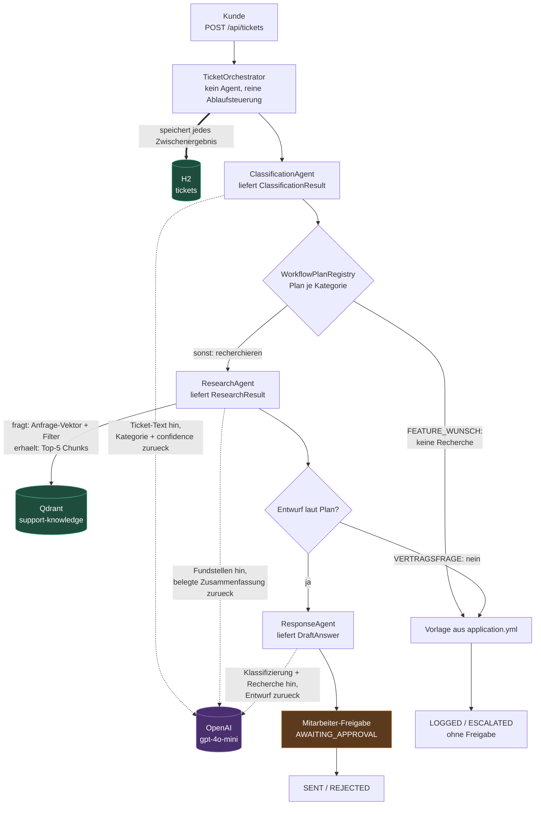

# spring-ai-agents-demo

Multi-Agenten-System für Kundenanfragen: ein Agent klassifiziert, ein zweiter recherchiert
in internen Wissensquellen, ein dritter formuliert einen Antwortentwurf — freigegeben durch
einen Mitarbeiter.

Grobarchitektur und Design-Entscheidungen: [docs/01-Multi-Agenten-Support-Architektur.md](docs/01-Multi-Agenten-Support-Architektur.md).

## Stack

| Baustein | Umsetzung |
|---|---|
| Backend | Spring Boot 3.5.16, Java 21 |
| LLM-Anbindung | Spring AI 1.1.0, `spring-ai-starter-model-openai` (`gpt-4o-mini`) |
| Embeddings | `spring-ai-starter-model-transformers` (lokal, ONNX/all-MiniLM, 384 Dim — keine API-Kosten fürs Indexieren) |
| Vektordatenbank | Qdrant via `compose.yaml`, Collection `support-knowledge` |
| Ticket-Persistenz | Spring Data JPA + H2 (In-Memory, **nur Demo**) |
| Live-Status | SSE über `SseEmitter` |
| Frontend | React 18 + TypeScript + Vite |

## Die drei Agenten

Ein „Agent" ist hier kein eigener Prozess, sondern eine Spring-`@Service`-Klasse, die drei
Dinge fest verbindet: ein **Eingabe-DTO**, einen **System-Prompt** und ein **Ausgabe-DTO**
mit festem JSON-Schema. Alle drei implementieren `Agent<I, O>`; keiner kennt den Ablauf,
die Datenbank oder die anderen beiden. Das macht sie einzeln testbar und austauschbar.

| Agent | Eingabe | LLM-Call | Retrieval | Ausgabe |
|---|---|---|---|---|
| `ClassificationAgent` | Ticket-Text | **ja** | nein | `ClassificationResult` (category, confidence, keywords) |
| `ResearchAgent` | Text + Kategorie | **ja** | **ja** (Qdrant) | `ResearchResult` (summary, sources) |
| `ResponseAgent` | Text + Klassifizierung + Recherche | **ja** | nein | `DraftAnswer` (text, sources, confidence) |

Der Orchestrator ist selbst **kein** Agent — er kennt nur die Reihenfolge, ruft die Agenten
als normale Java-Methoden auf und persistiert jedes Zwischenergebnis.

### Wo das LLM arbeitet und wo der eigene Kontext dazukommt

Pro Ticket fallen maximal **drei** LLM-Calls an — einer pro Agent, je nach Pfad weniger.
Jede Zelle nennt den Call und in Klammern, ob Firmeninhalte in seinem Prompt stehen:

| Pfad | 1. Klassifizierung | 2. Recherche | 3. Antwort | Calls |
|---|---|---|---|---|
| `TECHNISCHES_PROBLEM`, `SONSTIGES` | ✔ (ohne Kontext) | ✔ (mit Kontext) | ✔ (mit Kontext) | **3** |
| `VERTRAGSFRAGE` | ✔ (ohne Kontext) | ✔ (mit Kontext) | — | **2** |
| `FEATURE_WUNSCH` | ✔ (ohne Kontext) | — | — | **1** |

Der erste Call ist immer die Klassifizierung, und sie läuft **immer ohne eigenen Kontext**:
Ticket-Text rein, JSON raus. Sie muss ja gerade erst entscheiden, in welchem Bereich die
Anfrage liegt — vorher gibt es keine sinnvolle Einschränkung, wonach man suchen sollte.

Wichtig für das Kostenbild: die **Qdrant-Abfrage passiert genau einmal** pro Ticket, im
Recherche-Schritt. Der Antwort-Call hat zwar Firmeninhalte im Prompt, holt sie aber nicht
selbst — er bekommt sie vom `ResearchAgent` weitergereicht. „Zwei Calls mit Kontext" heißt
also **nicht** „zwei Suchanfragen".

Der Recherche-Schritt besteht aus zwei Teilen, und beide laufen ab, **bevor** das LLM etwas
sieht:

1. **Retrieval** — die Kundenanfrage wird lokal zu einem 384-dimensionalen Vektor
   (`TransformersEmbeddingModel`, ONNX, keine API-Kosten) und gegen Qdrant gesucht. Dabei
   greift ein Metadaten-Filter: `(category == <Ticket-Kategorie> || category == ALLGEMEIN)
   && audience == CUSTOMER`. Ergebnis sind bis zu 5 Chunks.
2. **Augmentation** — diese Chunks gehen als Text in den User-Prompt, zusammen mit der
   Anweisung, ausschließlich daraus zusammenzufassen und nichts zu erfinden.

### Indizieren vs. Suchen — zweimal dieselbe Umrechnung

**Einbetten (Embedding)** heißt: ein Stück Text in eine Liste von 384 Zahlen umrechnen, die
seine Bedeutung repräsentiert. Ähnliche Bedeutung ergibt nahe beieinanderliegende Vektoren.
Es ist eine reine Umrechnung und sagt nichts darüber, was danach mit dem Vektor passiert —
und genau da liegt der Unterschied zwischen den beiden Stellen im System:

| | Umgerechnet wird | Der Vektor wird | Wann | Wer |
|---|---|---|---|---|
| **Indizieren** | ein Dokument-Chunk | in Qdrant **gespeichert** | beim Start und bei `POST /api/knowledge/reindex` | `KnowledgeIngestService` |
| **Suchen** | die Kundenanfrage | nur zum **Vergleichen** benutzt und weggeworfen | bei jedem Ticket im Recherche-Schritt | `ResearchAgent` |



Das *Front Matter* im ersten Schritt ist der Metadaten-Kopf der `.md`-Datei — der Block
zwischen zwei `---`-Zeilen am Dateianfang, siehe [Wissensquellen](#wissensquellen).

Beide Seiten **müssen** dasselbe Modell benutzen — nur dann liegen Anfrage und Dokumente im
selben Vektorraum und die Ähnlichkeit ist überhaupt aussagekräftig. Praktische Folge: das
Embedding-Modell ist eine einmalige Entscheidung. Ein Wechsel bedeutet andere
Dimensionalität, also neue Collection und vollständige Neuindizierung — die alten Vektoren
sind wertlos. Der Chat-Provider (OpenAI) lässt sich dagegen jederzeit tauschen, er hat mit
den Embeddings nichts zu tun.

Der `ResponseAgent` fragt Qdrant **nicht selbst** an. Er bekommt die Zusammenfassung des
`ResearchAgent` plus dessen Quellenangaben (Titel und Zitat) — also gefilterten,
vorverarbeiteten Kontext, keinen direkten Zugriff auf die Wissensbasis. Der
`ClassificationAgent` arbeitet ganz ohne eigenen Kontext: reiner Text-in/JSON-out-Call.

> **Wichtig zur Abgrenzung:** die Dokumente liegen **nicht** in H2. H2 enthält
> ausschließlich die Tickets. Die Wissensquellen liegen als Embeddings in **Qdrant**; die
> `.md`-Dateien unter `backend/src/main/resources/knowledge/` sind die Quelle des Ingest.

### Das Muster: Retrieval-Augmented Generation (RAG)

Die Kombination aus `ResearchAgent` und `ResponseAgent` ist genau das, was RAG bezeichnet:
erst aus einer externen Wissensquelle abrufen (*Retrieval*), das Ergebnis in den Prompt
geben (*Augmented*), dann formulieren lassen (*Generation*). Der Zweck ist, dass die Antwort
auf belegbaren Firmeninhalten steht statt auf dem Trainingswissen des Modells.

Drei Abgrenzungen, weil „RAG" oft zu weit gefasst wird:

- **Der `ClassificationAgent` ist kein RAG.** Er ruft nichts ab. Ein LLM-Call allein ist
  keine Retrieval-Augmentation.
- **Retrieval und Generation sind hier auf zwei Agenten verteilt.** Im Lehrbuch ist RAG ein
  Schritt (suchen → antworten). Hier fasst erst ein Agent die Fundstellen belegt zusammen,
  danach formuliert ein zweiter die Kundenantwort. Das kostet einen zusätzlichen LLM-Call,
  macht aber die Recherche einzeln prüfbar — sie wird als eigenes Zwischenergebnis
  persistiert.
- **Der Metadaten-Filter ist Teil des Retrieval-Designs**, nicht Beiwerk. Er entscheidet,
  was das LLM überhaupt sehen *darf*: `audience == CUSTOMER` verhindert, dass interne
  Dokumente in eine Kundenantwort einfließen. Ein reines „Top-5 nach Ähnlichkeit" hätte
  diese Kontrolle nicht.

### Ablauf mit LLM- und Retrieval-Punkten

Lesehilfe: **die Pfeilrichtung zeigt, wer den Aufruf auslöst.** Was zurückkommt, steht im
Label — es gibt bewusst keine Kante, die von einer Datenbank ausgeht, denn Qdrant und H2
lösen nichts aus, sie antworten nur.

- durchgezogen `──▶` = nächster Ablaufschritt
- gestrichelt `-.-▶` = LLM-Aufruf (Prompt hin, strukturierte Antwort zurück)
- fett `══▶` = Schreiben in die Datenbank



Der Feature-Wunsch-Pfad erreicht das LLM genau einmal (Klassifizierung) und danach nie
wieder — sein Kundentext kommt aus einer Vorlage, nicht aus dem Modell. Und nur der
`ResearchAgent` hat überhaupt eine Kante zu Qdrant: er ist die einzige Stelle, an der
eigener Kontext ins System kommt.

## Starten

```powershell
# 1. Qdrant (REST 6343, gRPC 6344)
docker compose up -d

# 2. Backend (Port 8110)
$env:OPENAI_API_KEY = "sk-proj-..."
cd backend; mvn spring-boot:run

# 3. Frontend (Port 5173, proxyt /api auf 8110)
cd frontend; npm install; npm run dev
```

Qdrant **muss laufen**, bevor das Backend startet — `initialize-schema: true` legt die
Collection beim Boot an, ohne erreichbares Qdrant kommt die App nicht hoch.
Die Ports sind bewusst auf 6343/6344 gelegt, damit sie nicht mit dem Qdrant aus
`spring-ai-demo` (6333/6334) kollidieren.

### API-Key hinterlegen

Der Key steht nirgendwo im Repository — weder als Datei noch versioniert. Zwei
gleichwertige Wege:

- **IntelliJ:** in der Run-Config `AiAgentsApplication` als Umgebungsvariable
  `OPENAI_API_KEY` eintragen (`Edit Configurations… → Environment variables`). IntelliJ
  speichert das in `.idea/workspace.xml`, per `.idea/.gitignore` von der Versionierung
  ausgeschlossen.
- **Terminal:** vor dem Start setzen, siehe oben (`$env:OPENAI_API_KEY = "..."`).

Beide Wege sind gleichrangig — es gibt keine Datei, die eine gesetzte Variable
überschreiben könnte.

Der erste Start lädt das lokale Embedding-Modell (~90 MB) herunter und indexiert
`backend/src/main/resources/knowledge/*.md` nach Qdrant.

Qdrant-Dashboard: <http://localhost:6343/dashboard>

## Wissensquellen

Jede Datei unter `backend/src/main/resources/knowledge/` beschreibt sich selbst — eine neue
Quelle braucht keine Java-Änderung. Dafür sorgt ihr **Front Matter**.

> **Front Matter** ist ein Metadaten-Block **am Anfang** einer Markdown-Datei, abgegrenzt
> durch je eine Zeile mit `---` davor und danach. Er enthält Angaben *über* das Dokument,
> nicht dessen Inhalt, und wird beim Rendern nicht mit ausgegeben. Die Konvention stammt aus
> Static-Site-Generatoren wie Jekyll oder Hugo; der Begriff selbst kommt aus dem Buchdruck,
> wo „front matter" die Seiten vor dem eigentlichen Text meint — Titelblatt, Impressum,
> Inhaltsverzeichnis.

Der Block muss die **erste** Zeile der Datei sein, sonst wird er als normaler Inhalt
behandelt:

```markdown
---
category: VERTRAGSFRAGE
audience: CUSTOMER
title: Vertraege und Abrechnung
---

# Vertraege und Abrechnung

Ab hier beginnt der Inhalt, der indexiert wird.
```

Geparst wird das von `FrontMatter.parse(...)` — bewusst ein paar Zeilen eigener Code statt
einer YAML-Bibliothek, weil nur drei Schlüssel gebraucht werden. Alles zwischen den beiden
`---`-Zeilen landet als Metadaten in Qdrant, alles darunter wird zu Chunks und eingebettet.

| Feld | Bedeutung | Default ohne Front Matter |
|---|---|---|
| `category` | passt zum `Category`-Enum; `ALLGEMEIN` gilt für jede Anfrage | `ALLGEMEIN` |
| `audience` | `CUSTOMER` = darf in Kundenantworten einfließen, `INTERNAL` = nicht | **`INTERNAL`** |
| `title` | Anzeigename in der Quellenangabe | Dateiname |

Der `ResearchAgent` sucht per `filterExpression`:

```
(category == <Ticket-Kategorie> || category == ALLGEMEIN) && audience == CUSTOMER
```

Die Kategorie ist bewusst eine **ODER**-Bedingung: Servicezeiten passen zu jeder Anfrage,
und eine Fehlklassifizierung würde den Agenten bei einem harten Filter blind machen.

Die Sichtbarkeit ist dagegen eine **UND**-Bedingung, und `INTERNAL` ist der Default. Eine
versehentlich abgelegte interne Datei — Anweisung, Protokoll, Vertragsentwurf — ist damit
automatisch von Kundenantworten ausgeschlossen; freigegeben wird explizit, nicht
umgekehrt. Der Mitarbeiter-Freigabeschritt ist die zweite Verteidigungslinie, nicht die
erste.

Zwei Nebenwirkungen, die man kennen sollte:

- **`ALLGEMEIN` konkurriert in jeder Suche.** Ein umfangreiches Dokument dieser Kategorie
  belegt bei jeder Anfrage `topK`-Plätze und verdrängt passendere Treffer. `ALLGEMEIN` ist
  für kurze, querschnittliche Inhalte gedacht, nicht als Auffangkorb.

### Neu indexieren ohne Neustart

```
POST /api/knowledge/reindex
```

Der Lauf ist idempotent und darf beliebig oft aufgerufen werden. Die Antwort listet je
Quelle Kategorie, Sichtbarkeit und Chunk-Anzahl — praktisch, um zu sehen, ob das Front
Matter erkannt wurde.

Beim Start wird einmalig indexiert (`app.knowledge.index-on-startup`), damit die Demo
sofort benutzbar ist.

### Woher gelesen wird

`app.knowledge.location` ist eine Liste; es gewinnt die **erste Location, die überhaupt
etwas liefert**, die übrigen werden ignoriert. Default:

```
file:src/main/resources/knowledge/*.md,classpath:knowledge/*.md
```

Aus dem Quellbaum gestartet (IntelliJ, `mvn spring-boot:run`) greift der `file:`-Eintrag —
eine im Editor geänderte `.md` wirkt damit nach einem Reindex sofort, ohne Rebuild und
ohne Neustart. Aus einem gepackten Jar liefert `file:` nichts und `classpath:` übernimmt,
ohne Konfigurationsänderung.

Bewusst **keine** Verschmelzung pro Dateiname: sonst taucht eine aus dem Quellbaum
gelöschte Datei aus dem alten `target/classes` wieder auf und wird weiter indexiert. Genau
eine Location ist die Wahrheit. Überschreiben lässt sich das per `KNOWLEDGE_LOCATION`.

Das Feld `origin` in der Reindex-Antwort zeigt pro Quelle den aufgelösten Pfad — damit ist
sofort sichtbar, ob die bearbeitete Datei oder eine Kopie gelesen wurde.

Der Ingest (`KnowledgeIngestService`) **rekonziliert** den Index gegen das Dateiverzeichnis
und ist damit beliebig oft wiederholbar:

1. Point-IDs sind deterministische UUIDs aus Datei + Position + Inhalt → unveränderter
   Inhalt ist ein Upsert auf dieselbe ID, keine Duplikate.
2. Vor dem Schreiben entfernt `delete("source == ...")` die bestehenden Chunks der Datei →
   keine Geister-Chunks, wenn eine Datei gekürzt wird.
3. Danach entfernt `delete("source nin [...]")` die Chunks aller Quellen, die es nicht mehr
   gibt → eine gelöschte Datei verschwindet auch aus dem Index.

Schritt 3 ist nicht optional: ohne ihn bleibt eine aus der Wissensbasis entfernte Quelle
dauerhaft durchsuchbar — bei einem internen Dokument ein echtes Problem.

## API

| Endpoint | Zweck |
|---|---|
| `POST /api/tickets` | Anfrage anlegen, Workflow asynchron starten |
| `GET /api/tickets` | Alle Tickets (neueste zuerst) |
| `GET /api/tickets/{id}` | Ticket-Zustand inkl. aller Zwischenergebnisse |
| `GET /api/tickets/{id}/draft` | Nur der Antwortentwurf |
| `POST /api/tickets/{id}/approve` | Freigabe/Ablehnung durch den Mitarbeiter |
| `GET /api/tickets/{id}/stream` | SSE-Stream der Statuswechsel |
| `POST /api/knowledge/reindex` | Wissensquellen neu indexieren (idempotent, kein Neustart) |

H2-Konsole: <http://localhost:8110/h2-console> (JDBC-URL `jdbc:h2:mem:tickets`, User `sa`).

## Ablauf

```
NEW ──► CLASSIFIED ──┬──► RESEARCHED ──► AWAITING_APPROVAL ──► SENT | REJECTED
                     ├──► ESCALATED   (Vertragsfrage: Recherche + Eingangsbestaetigung)
                     └──► LOGGED      (Feature-Wunsch: Backlog + Eingangsbestaetigung)
```

| Kategorie | Recherche | Entwurf | Text an den Kunden |
|---|---|---|---|
| `TECHNISCHES_PROBLEM`, `SONSTIGES` | ja | ja | erst nach Mitarbeiter-Freigabe |
| `VERTRAGSFRAGE` | ja | nein | Vorlage, ohne Freigabe |
| `FEATURE_WUNSCH` | nein | nein | Vorlage, ohne Freigabe |

Die Pfade ohne Entwurf verschicken eine **feste Eingangsbestätigung** je Kategorie
(`app.notifications.acknowledgements.<KATEGORIE>`, Platzhalter `{ticketId}`). Ohne Freigabe
ist das nur zulässig, weil der Wortlaut vorab festgelegt ist — die Trennlinie ist
**generiert vs. vorformuliert**, nicht „mit/ohne Freigabe".

Drei Tests halten das fest: kein Plan erzeugt gleichzeitig einen LLM-Entwurf *und*
verschickt ungefragt; jede Kategorie führt zu Entwurf **oder** Bestätigung, damit niemand
ohne Rückmeldung bleibt; und jede sendende Kategorie hat eine Vorlage mit aufgelöster
Referenz. Fehlt zu einem sendenden Plan die Vorlage, **scheitert der Start** — ein
Tippfehler im Kategorie-Schlüssel wäre sonst ein stiller Ausfall.

Die Verzweigung liegt in `WorkflowPlanRegistry` — eine neue Kategorie mit eigenem Pfad ist
ein zusätzlicher Map-Eintrag, die Agenten bleiben unberührt (Option A aus der Architektur).

## Bewusste Vereinfachungen im Grundgerüst

- **Zwei Modell-Provider parallel:** Chat über OpenAI, Embeddings lokal über Transformers.
  Weil der OpenAI-Starter ebenfalls ein Embedding-Modell mitbringt, ist
  `spring.ai.model.embedding: transformers` load-bearing — ohne den Schalter ist die
  Auswahl nicht eindeutig.
- **H2 in-memory für die Tickets:** `ddl-auto: create-drop`, nach dem Neustart sind die
  Tickets weg. Produktiv wäre hier Postgres — Qdrant ist davon unabhängig und persistiert
  bereits im Docker-Volume `qdrant-data`.
- **Ingest auch beim Start:** zusätzlich zum Reindex-Endpoint indexiert
  `KnowledgeBaseLoader` einmalig beim Boot. Bequem für die Demo, aber bei mehreren
  Instanzen macht jede dieselbe Arbeit — dann `app.knowledge.index-on-startup: false`
  setzen und den Endpoint aus einem Deployment-Schritt aufrufen.
- **Kein Auth:** die API ist offen, auch der Reindex-Endpoint. Produktiv gehört der hinter
  eine Authentifizierung, sonst kann jeder den Index neu schreiben lassen.
- **SSE-Emitter im Speicher:** `TicketEventPublisher` funktioniert nur bei einer Instanz.
  Mehrere Instanzen brauchen einen Broker.
- **Kein Versand:** `TicketOrchestrator.finalizeTicket` setzt `SENT`, verschickt aber nichts.
