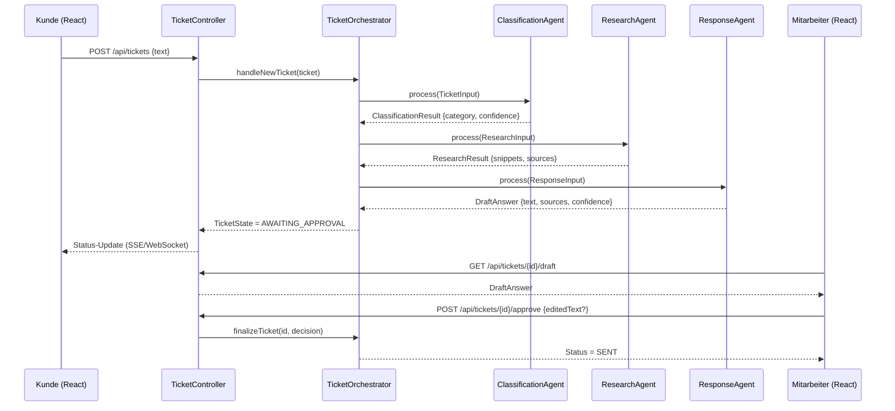

# Grobarchitektur: Multi-Agenten-System für Kundenanfragen

**Use Case:** Ein Agent klassifiziert eingehende Kundenanfragen, ein zweiter recherchiert in internen Wissensquellen, ein dritter formuliert einen Antwortentwurf, den ein Mitarbeiter freigibt.

**Stack:** Spring Boot (Backend/Orchestrierung), Spring AI (LLM-Anbindung), React (Frontend), relationale DB + Vektordatenbank (Wissensquellen).

---

## 1. Was ist ein "Agent" hier eigentlich, code-technisch?

Das ist der wichtigste Punkt, deshalb zuerst: Ein "Agent" ist **kein** eigenständiger Prozess, kein Mini-Programm mit eigenem Willen. Er ist schlicht eine **Spring-Service-Klasse**, die drei Dinge fest kombiniert:

1. Ein **Eingabe-Objekt** (DTO/POJO) – was der Agent an Kontext bekommt.
2. Einen **System-Prompt** – die Rollenbeschreibung, die dem LLM mitgegeben wird ("Du bist ein Klassifizierungs-Agent, der Anfragen in genau eine der folgenden Kategorien einordnet...").
3. Ein **Ausgabe-Objekt** (DTO) – ein festes JSON-Schema, in das die LLM-Antwort strukturiert zurückgegeben wird (kein freier Text).

Zusätzlich kann ein Agent **Tools** (Java-Methoden, die das LLM bei Bedarf aufrufen darf, z. B. `searchKnowledgeBase(query)`) besitzen – das ist bei "Recherche" typischerweise der Fall.

Alle drei Agenten implementieren dasselbe generische Interface, damit der Orchestrator sie austauschbar behandeln kann:

```java
public interface Agent<I, O> {
    O process(I input);
}
```

Jeder Agent ist also im Kern: **ein Spring `@Service`, der einen `ChatClient`-Aufruf (Spring AI) mit festem Prompt + festem Input/Output-Schema kapselt.** Nichts Magisches – die "Intelligenz" steckt im LLM-Call, die Rolle/Grenzen stecken im Java-Code der Service-Klasse.

---

## 2. Ablauf auf einen Blick (Sequenzdiagramm)



Wichtig: Jeder Pfeil zwischen Orchestrator und Agent ist ein **normaler Java-Methodenaufruf** (kein Netzwerk-Roundtrip) – die Agenten laufen im selben Backend-Prozess. Nur der Aufruf *innerhalb* eines Agenten an den LLM-Provider geht nach außen (HTTPS zur LLM-API).

---

## 3. Module und Verantwortlichkeiten

### 3.1 Frontend (React)

| Komponente | Aufgabe |
|---|---|
| `TicketForm` | Kunde erfasst neue Anfrage, sendet `POST /api/tickets` |
| `TicketStatusStepper` | Zeigt Live-Fortschritt ("Wird eingeordnet…" → "Wird recherchiert…" → "Entwurf wird erstellt…"), hört auf SSE/WebSocket |
| `DraftReviewPanel` | Mitarbeiter-Ansicht: zeigt Klassifizierung, gefundene Quellen und Entwurfstext, editierbar; Buttons "Freigeben" / "Ablehnen" |
| `api/ticketClient.ts` | Kapselt REST-Calls + SSE-Subscription |

Das Frontend kennt die Agenten **nicht einzeln** – es sieht nur den Ticket-Zustand und das Endergebnis pro Schritt. Das hält die Kopplung locker.

### 3.2 API-Schicht (Spring Boot `@RestController`)

```java
@RestController
@RequestMapping("/api/tickets")
public class TicketController {

    @PostMapping
    ResponseEntity<TicketView> create(@RequestBody NewTicketRequest req);

    @GetMapping("/{id}")
    ResponseEntity<TicketView> getStatus(@PathVariable UUID id);

    @GetMapping("/{id}/draft")
    ResponseEntity<DraftAnswer> getDraft(@PathVariable UUID id);

    @PostMapping("/{id}/approve")
    ResponseEntity<TicketView> approve(@PathVariable UUID id, @RequestBody ApprovalDecision decision);

    @GetMapping(value = "/{id}/stream", produces = MediaType.TEXT_EVENT_STREAM_VALUE)
    SseEmitter stream(@PathVariable UUID id); // SSE für Live-Fortschritt
}
```

Für den SSE-Endpoint reicht `SseEmitter` aus Spring MVC – damit bleibt WebFlux als Abhängigkeit außen vor. `Flux` wäre nur nötig, wenn das Backend ohnehin reaktiv gebaut würde.

Reine Aufgabe: HTTP entgegennehmen/validieren, an den Orchestrator weiterreichen, Ergebnis zurückgeben. Keine Geschäftslogik.

### 3.3 Orchestrator (Herzstück, kein Agent selbst)

```java
@Service
public class TicketOrchestrator {

    private final ClassificationAgent classificationAgent;
    private final ResearchAgent researchAgent;
    private final ResponseAgent responseAgent;
    private final TicketRepository ticketRepository;

    @Async
    public void runWorkflow(UUID ticketId) {
        Ticket ticket = ticketRepository.getById(ticketId);

        ClassificationResult classification =
            classificationAgent.process(new TicketInput(ticket.getText()));
        ticket.setClassification(classification);
        ticket.setState(TicketState.CLASSIFIED);
        ticketRepository.save(ticket);

        ResearchResult research =
            researchAgent.process(new ResearchInput(ticket.getText(), classification.category()));
        ticket.setResearch(research);
        ticket.setState(TicketState.RESEARCHED);
        ticketRepository.save(ticket);

        DraftAnswer draft =
            responseAgent.process(new ResponseInput(ticket.getText(), classification, research));
        ticket.setDraft(draft);
        ticket.setState(TicketState.AWAITING_APPROVAL);
        ticketRepository.save(ticket);

        eventPublisher.publish(ticketId, TicketState.AWAITING_APPROVAL);
    }

    public void finalize(UUID ticketId, ApprovalDecision decision) {
        // Freigabe/Bearbeitung verarbeiten, Antwort versenden, Ticket-State = SENT/REJECTED
    }
}
```

Der Orchestrator ist **reiner Ablaufsteuerungs-Code** – eine State Machine in Prosa-Form. Für exakt 3 Schritte ohne Verzweigung reicht das. Sobald aber je Kategorie unterschiedliche Pfade nötig sind (siehe 3.3.1), lohnt es sich, das von Anfang an explizit statt in verschachtelten `if`s zu modellieren.

### 3.3.1 Branching nach Kategorie: Plan-Registry (**gewählte Lösung**)

Das Beispiel von oben – "bei Vertragsfrage einen anderen Pfad nehmen" – wird über eine leichtgewichtige Plan-Registry pro Kategorie umgesetzt. **Keine Zusatzbibliothek**, kein Framework für Ablaufsteuerung. Die schwergewichtige Alternative (Spring State Machine) ist bewusst verworfen und nur als Ausbaupfad dokumentiert (siehe 3.3.2).

Statt eines wachsenden `if`/`switch` im Orchestrator gibt es eine Zuordnung Kategorie → Ablaufplan. Eine neue Kategorie oder ein neuer Pfad bedeutet: **ein neuer Map-Eintrag**, kein bestehender Code wird verändert.

```java
public record WorkflowPlan(
    boolean runResearch,
    boolean runResponseDraft,
    TicketState terminalStateIfSkipped // z. B. LOGGED oder ESCALATED, sonst null
) {}

@Component
public class WorkflowPlanRegistry {

    private final Map<Category, WorkflowPlan> plans = Map.of(
        Category.TECHNISCHES_PROBLEM, new WorkflowPlan(true, true, null),
        // Vertragsfrage: recherchieren (Vertragsdaten), aber KEIN Auto-Entwurf – direkt an Fachabteilung
        Category.VERTRAGSFRAGE,       new WorkflowPlan(true, false, TicketState.ESCALATED),
        // Feature-Wunsch: weder Recherche noch Entwurf nötig – nur ins Backlog loggen
        Category.FEATURE_WUNSCH,      new WorkflowPlan(false, false, TicketState.LOGGED),
        Category.SONSTIGES,           new WorkflowPlan(true, true, null)
    );

    public WorkflowPlan planFor(Category category) {
        return plans.getOrDefault(category, plans.get(Category.SONSTIGES));
    }
}
```

Der Orchestrator liest nach der Klassifizierung nur noch den passenden Plan und führt ihn aus:

```java
@Async
public void runWorkflow(UUID ticketId) {
    Ticket ticket = ticketRepository.getById(ticketId);

    ClassificationResult classification = classificationAgent.process(new TicketInput(ticket.getText()));
    ticket.setClassification(classification);

    WorkflowPlan plan = workflowPlanRegistry.planFor(classification.category());

    if (plan.runResearch()) {
        ResearchResult research =
            researchAgent.process(new ResearchInput(ticket.getText(), classification.category()));
        ticket.setResearch(research);
        advance(ticket, TicketState.RESEARCHED);
    }

    if (plan.runResponseDraft()) {
        DraftAnswer draft = responseAgent.process(
            new ResponseInput(ticket.getText(), classification, ticket.getResearch()));
        ticket.setDraft(draft);
        advance(ticket, TicketState.AWAITING_APPROVAL);
    } else {
        // Kein Auto-Entwurf: direkt in den Endzustand des Plans (LOGGED / ESCALATED)
        advance(ticket, plan.terminalStateIfSkipped());
    }
}

// advance(...) = State setzen, Ticket speichern, Event publizieren
```

Wichtig an der Reihenfolge: `terminalStateIfSkipped` wird **nach** der Recherche ausgewertet, nicht davor. Sonst würde die Vertragsfrage (Recherche ja, Entwurf nein) sofort eskalieren, ohne dass die Vertragsdaten je nachgesehen wurden.

Die Agenten selbst (Abschnitt 3.4) ändern sich dabei überhaupt nicht – es wird nur bedingt aufgerufen, ob und in welcher Reihenfolge. Für diesen Use Case mit ein paar Kategorien reicht das völlig aus.

### 3.3.2 Ausbaupfad (nicht Teil der Umsetzung): Spring State Machine

Nur relevant, falls später eintritt: viele Kategorien, sich gegenseitig ausschließende Bedingungen, echte Parallelität (z. B. Recherche + Compliance-Prüfung gleichzeitig) oder Persistenz des Ablaufs über Tage. Hier zur Vollständigkeit skizziert, **aktuell nicht umgesetzt**:

Zusätzliche Abhängigkeit: `spring-statemachine-core` (optional `spring-statemachine-data-jpa` für Persistenz). Der Ablauf wird nicht mehr in Java-`if`s versteckt, sondern deklarativ als Zustände/Übergänge/Wächter (Guards) konfiguriert:

```java
public enum TicketState {
    NEW, CLASSIFIED, RESEARCHED, DRAFTED, AWAITING_APPROVAL, LOGGED, ESCALATED, SENT, REJECTED
}

public enum TicketEvent {
    SUBMITTED, CLASSIFIED_EVT, RESEARCH_DONE, DRAFT_DONE, APPROVED, REJECTED_EVT
}

@Configuration
@EnableStateMachineFactory
public class TicketStateMachineConfig extends StateMachineConfigurerAdapter<TicketState, TicketEvent> {

    @Override
    public void configure(StateMachineTransitionConfigurer<TicketState, TicketEvent> transitions) throws Exception {
        transitions
            .withExternal().source(TicketState.NEW).target(TicketState.CLASSIFIED)
                .event(TicketEvent.SUBMITTED).action(classificationAction()).and()

            // Drei Guards konkurrieren um dasselbe Event – nur der zutreffende darf feuern
            .withExternal().source(TicketState.CLASSIFIED).target(TicketState.RESEARCHED)
                .event(TicketEvent.CLASSIFIED_EVT).guard(needsFullPipelineGuard()).action(researchAction()).and()
            .withExternal().source(TicketState.CLASSIFIED).target(TicketState.LOGGED)
                .event(TicketEvent.CLASSIFIED_EVT).guard(isFeatureRequestGuard()).action(logOnlyAction()).and()
            .withExternal().source(TicketState.CLASSIFIED).target(TicketState.ESCALATED)
                .event(TicketEvent.CLASSIFIED_EVT).guard(isContractQuestionGuard()).action(escalateAction()).and()

            .withExternal().source(TicketState.RESEARCHED).target(TicketState.DRAFTED)
                .event(TicketEvent.RESEARCH_DONE).action(responseAction()).and()
            .withExternal().source(TicketState.DRAFTED).target(TicketState.AWAITING_APPROVAL)
                .event(TicketEvent.DRAFT_DONE).and()
            .withExternal().source(TicketState.AWAITING_APPROVAL).target(TicketState.SENT)
                .event(TicketEvent.APPROVED).and()
            .withExternal().source(TicketState.AWAITING_APPROVAL).target(TicketState.REJECTED)
                .event(TicketEvent.REJECTED_EVT);
    }
}
```

Ein Guard prüft nur, ob sein Zweig zuständig ist – die Agenten-Logik selbst bleibt unverändert in `ClassificationAgent`/`ResearchAgent`/`ResponseAgent` (Abschnitt 3.4), sie wird nur aus einer `Action` heraus aufgerufen statt direkt aus dem Orchestrator:

```java
@Component
public class IsFeatureRequestGuard implements Guard<TicketState, TicketEvent> {
    @Override
    public boolean evaluate(StateContext<TicketState, TicketEvent> ctx) {
        var classification = ctx.getExtendedState().get("classification", ClassificationResult.class);
        return classification.category() == Category.FEATURE_WUNSCH;
    }
}
```

Vorteil gegenüber der Plan-Registry: Eine neue Kategorie mit eigenem Pfad bedeutet nur "neuer Guard + neue Transition". Zusätzlich bekommt man eine visualisierbare Automaten-Definition (PlantUML-Export) und – über `StateMachinePersist` – die Möglichkeit, den Zustand pro Ticket in der DB zu speichern und die Maschine nach Tagen Wartezeit auf eine Mitarbeiter-Freigabe wieder zu laden, statt sie im Speicher zu halten.

**Entscheidung:** Umgesetzt wird die Plan-Registry aus 3.3.1. Sie deckt "technisches Problem / Vertragsfrage / Feature-Wunsch / Sonstiges" plus weitere Kategorien locker ab. Der Wechsel auf die State Machine ist ein späterer, isolierter Umbau – nur der Orchestrator ist betroffen, die Agenten-Klassen bleiben unverändert.

### 3.4 Agenten-Schicht

Gemeinsames Interface (siehe Abschnitt 1), drei konkrete Implementierungen:

**`ClassificationAgent`** – reiner Text-in/JSON-out-Agent, kein Tool-Zugriff:

```java
@Service
public class ClassificationAgent implements Agent<TicketInput, ClassificationResult> {

    private final ChatClient chatClient; // Spring AI

    @Override
    public ClassificationResult process(TicketInput input) {
        return chatClient.prompt()
            .system("""
                Du bist ein Klassifizierungs-Agent für Kundenanfragen.
                Ordne den Text in GENAU eine Kategorie ein:
                TECHNISCHES_PROBLEM, VERTRAGSFRAGE, FEATURE_WUNSCH, SONSTIGES.
                Antworte ausschließlich im vorgegebenen JSON-Schema.
                """)
            .user(input.text())
            .call()
            .entity(ClassificationResult.class); // strukturierte Ausgabe, kein Freitext
    }
}

record ClassificationResult(Category category, double confidence, List<String> keywords) {}
```

**`ResearchAgent`** – nutzt Tools/RAG, kein freier Textoutput sondern belegte Fundstellen:

```java
@Service
public class ResearchAgent implements Agent<ResearchInput, ResearchResult> {

    private final VectorStore vectorStore;      // z. B. pgvector-Index über Doku + Ticket-Historie
    private final ChatClient chatClient;

    @Override
    public ResearchResult process(ResearchInput input) {
        List<Document> hits = vectorStore.similaritySearch(
            SearchRequest.query(input.text()).withTopK(5).withFilterExpression(
                "category == '" + input.category() + "'"));

        return chatClient.prompt()
            .system("""
                Du bist ein Recherche-Agent. Fasse aus den bereitgestellten Dokumenten
                nur Informationen zusammen, die zur Anfrage passen. Erfinde nichts.
                Gib die verwendeten Quellen mit an.
                """)
            .user(u -> u.text(input.text()).param("documents", hits))
            .call()
            .entity(ResearchResult.class);
    }
}

record ResearchResult(String summary, List<SourceRef> sources) {}
```

*Wissensquellen* (Dokumentation, Ticket-Historie, Wissensdatenbank) werden vorher per Batch-Job eingelesen, in Chunks zerlegt und embedded in den `VectorStore` geschrieben – das ist ein separater, offline laufender **Indexierungs-Prozess**, kein Teil des Live-Workflows.

Bei einem persistenten Store ist dieser Prozess zwingend **idempotent** zu bauen: ein blindes `add` bei jedem Lauf flutet die Collection mit Duplikaten (mal Instanzzahl), und beim Kürzen einer Quelle bleiben sonst veraltete Chunks als Geister in der Suche. Umsetzung hier: deterministische Point-ID aus Datei + Position + Inhalt (also Upsert statt Insert) plus `delete("source == ...")` vor dem Schreiben.

**`ResponseAgent`** – kombiniert beide Vorergebnisse zu einem Entwurf:

```java
@Service
public class ResponseAgent implements Agent<ResponseInput, DraftAnswer> {

    private final ChatClient chatClient;

    @Override
    public DraftAnswer process(ResponseInput input) {
        return chatClient.prompt()
            .system("""
                Du bist ein Antwort-Agent. Formuliere basierend auf Klassifizierung
                und Rechercheergebnis eine höfliche, korrekte Antwort an den Kunden.
                Kennzeichne unsichere Aussagen. Gib eine confidence 0-1 an.
                """)
            .user(u -> u
                .param("classification", input.classification())
                .param("research", input.research())
                .text(input.originalText()))
            .call()
            .entity(DraftAnswer.class);
    }
}

record DraftAnswer(String text, List<SourceRef> sources, double confidence) {}
```

**Wichtig:** Kein Agent schreibt direkt in die Datenbank oder ruft einen anderen Agenten auf. Das macht ausschließlich der Orchestrator – so bleibt jeder Agent isoliert testbar (Input rein, Output raus, ein LLM-Call).

### 3.5 Wissensquellen / Datenzugriff

| Quelle | Zugriff über | Genutzt von |
|---|---|---|
| Kundenwissen (FAQ, Vertragsregeln) | `VectorStore` (Qdrant, Collection `support-knowledge`), gefiltert auf `audience == CUSTOMER` | ResearchAgent |
| Ticket-Historie | `VectorStore` + `TicketHistoryRepository` (JPA) | ResearchAgent |
| Verträge/Kundendaten | `ContractRepository` (JPA, ggf. via internes API) | ResearchAgent (als Tool-Call, nicht Vektorsuche, da strukturierte Daten) |

### 3.6 Persistenz

```java
@Entity
class Ticket {
    UUID id;
    String customerText;
    TicketState state;          // NEW, CLASSIFIED, RESEARCHED, AWAITING_APPROVAL, SENT, REJECTED
    @Embedded ClassificationResult classification;
    @Embedded ResearchResult research;
    @Embedded DraftAnswer draft;
    Instant createdAt;
    Instant updatedAt;
}
```

Jedes Zwischenergebnis wird persistiert (nicht nur das Endergebnis). Das ist der Kernvorteil eines Multi-Agenten-Ansatzes laut Glossar: **jeder Schritt einzeln überprüfbar** – z. B. um später zu sehen, ob die Klassifizierung oft falsch lag, obwohl die Endantwort gut war.

---

## 4. Schnittstellen im Überblick

| Schnittstelle | Typ | Zweck |
|---|---|---|
| React → `TicketController` | REST (JSON über HTTPS) | Ticket anlegen, Draft abrufen, freigeben |
| React → `TicketController` | SSE (`/stream`) | Live-Fortschrittsanzeige |
| `TicketController` → `TicketOrchestrator` | Java-Methodenaufruf | Workflow anstoßen |
| `TicketOrchestrator` → `Agent<I,O>` (3x) | Java-Interface-Aufruf | Einzelschritt ausführen |
| Agent → `ChatClient` (Spring AI) | Abstrahierter LLM-Call | Prompt senden, strukturierte Antwort empfangen |
| `ChatClient` → LLM-Provider | HTTPS (aktuell OpenAI-API) | Eigentliche Inferenz |
| `ResearchAgent` → `VectorStore` | Bibliotheks-API (z. B. pgvector) | Ähnlichkeitssuche in Wissensquellen |
| `TicketOrchestrator` → `TicketRepository` | Spring Data JPA | Zustand persistieren |

---

## 5. Datenfluss als Zustandsautomat

| Zustand | Auslöser | Nächster Schritt | Von wem gesetzt |
|---|---|---|---|
| `NEW` | Kunde sendet Anfrage | ClassificationAgent aufrufen | Orchestrator |
| `CLASSIFIED` | Klassifizierung erhalten | `WorkflowPlanRegistry` liefert den Plan zur Kategorie → verzweigt in einen der drei folgenden Pfade | Orchestrator (siehe 3.3.1) |
| `RESEARCHED` | (Regelfall) Rechercheergebnis erhalten | ResponseAgent aufrufen | Orchestrator |
| `LOGGED` | (Feature-Wunsch) kein Research/Draft nötig | ins Backlog **plus feste Eingangsbestätigung an den Kunden**, kein Mitarbeiter-Review | Orchestrator |
| `ESCALATED` | (Vertragsfrage) Research ja, aber kein Auto-Entwurf | an die Fachabteilung **plus feste Eingangsbestätigung an den Kunden**, ohne KI-Entwurf | Orchestrator |
| `AWAITING_APPROVAL` | Entwurf erstellt | Frontend benachrichtigen, auf Mitarbeiter warten | Orchestrator |
| `SENT` / `REJECTED` | Mitarbeiter entscheidet | Antwort versenden bzw. verwerfen | Orchestrator (nach Mitarbeiter-Input) |

`LOGGED` und `ESCALATED` sind Beispiele für die Verzweigung aus 3.3.1 – neue Kategorien mit eigenem Pfad ergänzen einfach eine weitere Zeile in dieser Tabelle plus einen neuen Registry-Eintrag.

---

## 6. Technologie-Stack – Zusammenfassung

- **Backend:** Spring Boot 3.x, Spring AI (`ChatClient`, `VectorStore`-Abstraktion), Spring Data JPA, Spring WebFlux oder einfache SSE-Endpoints für Live-Status
- **LLM-Anbindung:** über Spring AI austauschbar (aktuell OpenAI; ebenso Anthropic, Azure, lokal via Ollama) – Agenten-Code bleibt gleich, nur Konfiguration ändert sich
- **Vektordatenbank:** Qdrant (`spring-ai-starter-vector-store-qdrant`), per `compose.yaml` daneben gestartet. Alternative: PostgreSQL mit `pgvector`-Extension – passt gut, wenn ohnehin Postgres für die Fachdaten läuft, dann ist es eine Datenbank statt zwei. Der Agenten-Code bleibt in beiden Fällen gleich, er kennt nur die `VectorStore`-Abstraktion
- **Frontend:** React (+ TypeScript empfohlen), z. B. mit `EventSource` für SSE oder `@microsoft/fetch-event-source`
- **Async/Queueing (optional, für Skalierung):** statt `@Async` innerhalb eines Requests könnte man ab einer gewissen Last auf Spring Events oder eine Message-Queue (z. B. RabbitMQ) zwischen den Agentenschritten umstellen, ohne die Agent-Klassen selbst zu ändern
- **Ablaufsteuerung:** eigene `WorkflowPlanRegistry` (plain Spring `@Component`, siehe 3.3.1) – **keine** zusätzliche Bibliothek. `spring-statemachine-core` bleibt als Ausbaupfad dokumentiert (3.3.2), wird aber nicht eingebunden

---

## 7. Wichtigste Design-Entscheidung noch einmal auf den Punkt gebracht

- Ein **Agent** = eine Service-Klasse mit festem Prompt + festem Input/Output-DTO + optionalen Tools. Er hat keine Erinnerung an vorherige Anfragen (stateless) und kein Wissen über die anderen Agenten.
- Der **Orchestrator** kennt den Ablauf und die Reihenfolge, die Agenten kennen nur ihre eigene Aufgabe. Das entspricht genau der Trennung, die im Glossareintrag als Vorteil genannt wird: jeder Schritt separat überprüfbar und austauschbar, ohne die anderen beiden anzufassen.
- Die **Verzweigung nach Kategorie** läuft über die Plan-Registry (3.3.1) und wächst an genau einer Stelle: ein neuer Eintrag in der `Map<Category, WorkflowPlan>`. Neue Anfragearten wie "Beschwerde" oder "Rückerstattung" lassen sich später ergänzen, ohne Classification-, Research- oder Response-Agent anzufassen. Ein Ablauf-Framework wird dafür bewusst nicht eingesetzt.
- Der Mensch (Mitarbeiter) ist bewusst **kein** vierter Agent, sondern ein expliziter Freigabe-Schritt im Zustandsautomaten – das ist bei einem Anwendungsfall mit Kundenkontakt der sinnvolle Sicherheitsmechanismus.
- Die Freigabe gilt für **generierte** Texte. Ein Kunde ohne jede Rückmeldung dastehen zu lassen wäre trotzdem schlechter Service, deshalb verschicken die Pfade *ohne* Entwurf (Feature-Wunsch, Vertragsfrage) eine **feste Eingangsbestätigung aus einer Vorlage** – ohne Freigabe, weil der Wortlaut vorab festgelegt ist und kein Modell daran beteiligt ist. Die Trennlinie ist damit nicht „mit/ohne Freigabe", sondern **generiert vs. vorformuliert**: sobald ein Modell den Text schreibt, muss er durch die Freigabe.
- Die Vorlagen liegen pro Kategorie unter `app.notifications.acknowledgements.<KATEGORIE>` – dieselbe Wachstumsstelle wie die Plan-Registry, eine neue Kategorie ergänzt beide um je einen Eintrag. Der `CustomerNotificationService` prüft beim Start, dass zu jedem sendenden Plan eine Vorlage existiert und **scheitert sonst**: ein Tippfehler im Kategorie-Schlüssel wäre sonst ein stiller Ausfall, bei dem der Kunde nichts erhält und es niemandem auffällt.
- Die **Sichtbarkeit der Wissensquellen** (`audience`) ist die erste Verteidigungslinie davor, dass interne Inhalte in Kundenantworten landen: der `ResearchAgent` sieht ausschließlich als `CUSTOMER` freigegebene Quellen, und der Default ist `INTERNAL`. Ein versehentlich in den Index gelegtes internes Dokument ist damit wirkungslos statt riskant. Sich allein auf die Mitarbeiter-Freigabe zu verlassen wäre die falsche Stelle für diese Kontrolle – sie prüft den Text, nicht seine Herkunft.
