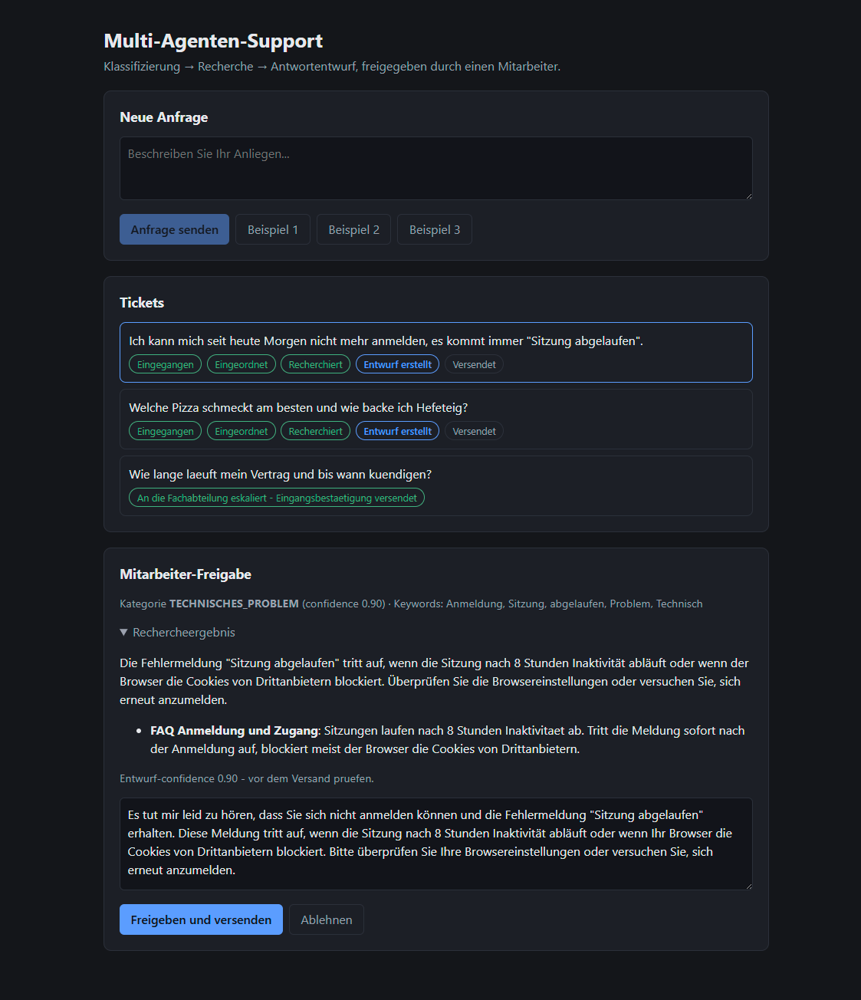
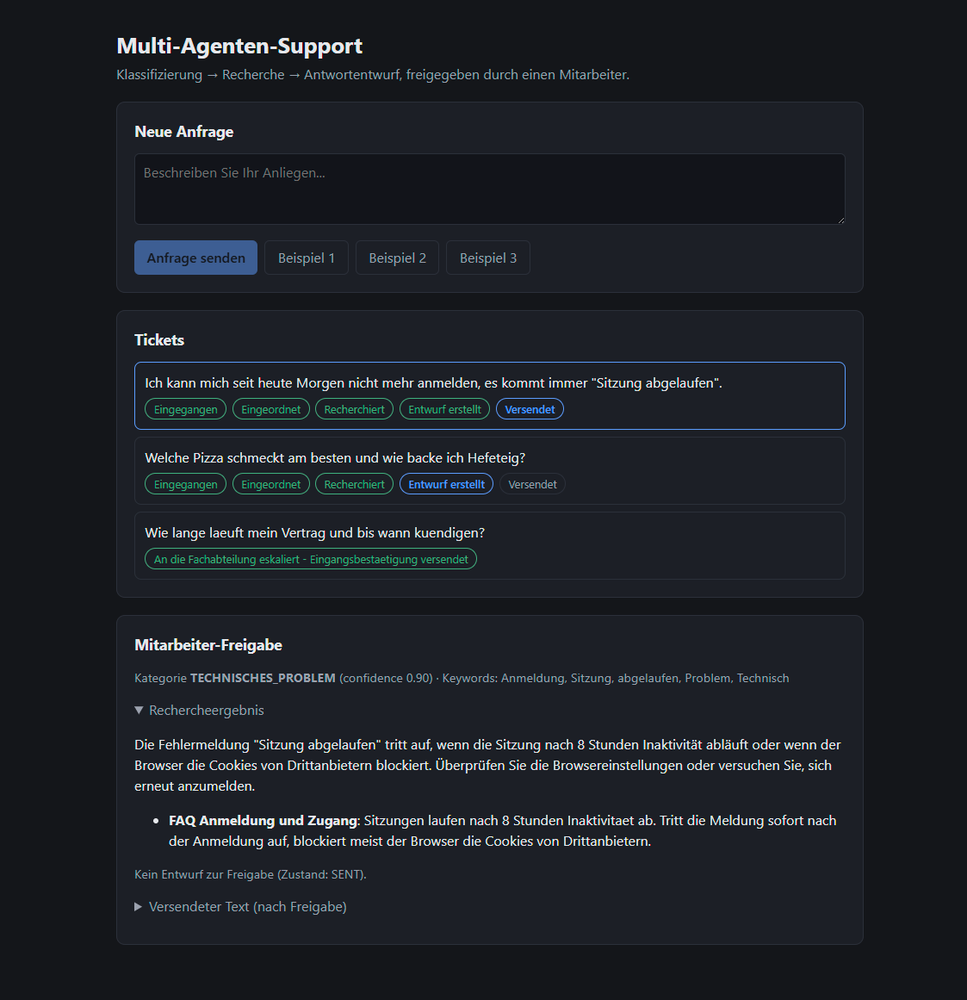
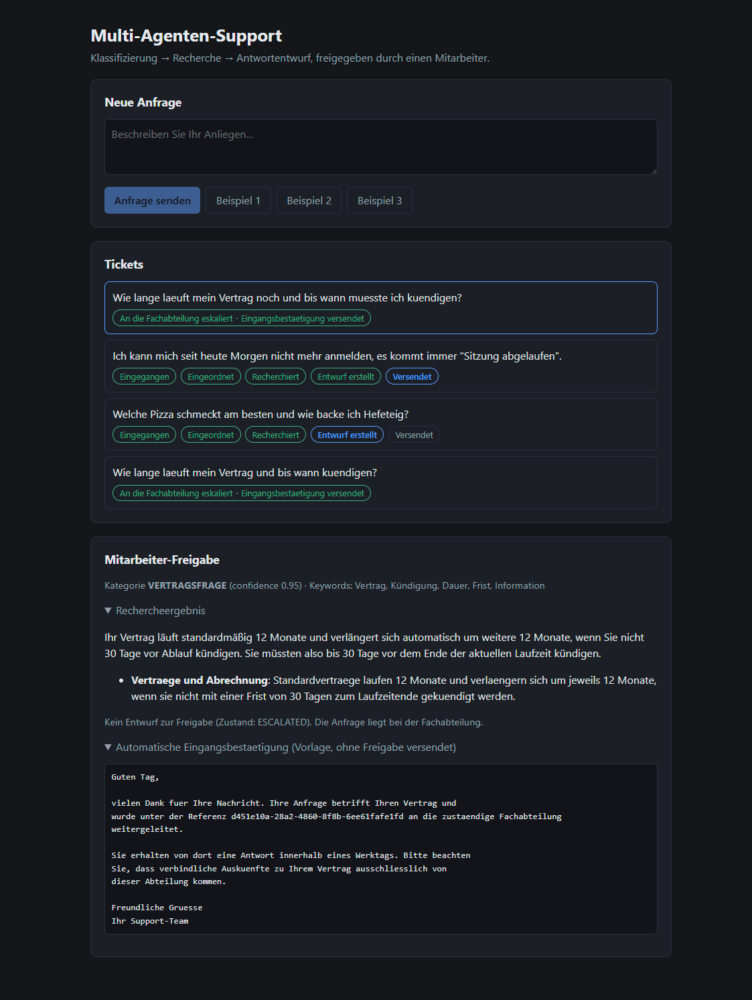
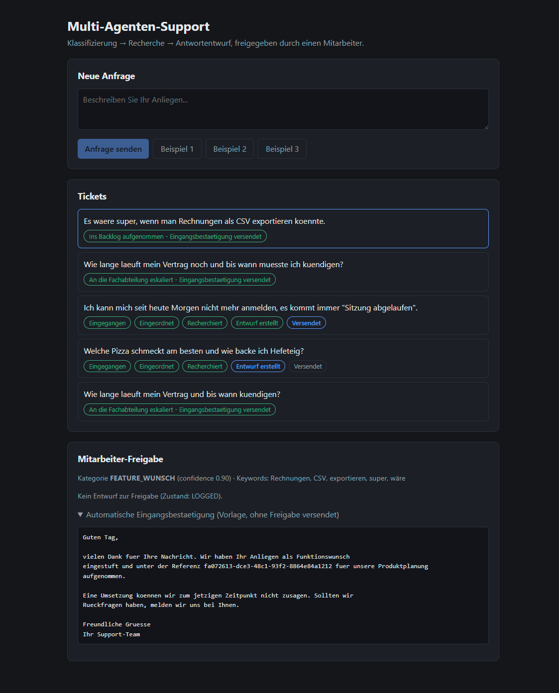

# Anleitung: Lokal starten und ausprobieren

Diese Anleitung führt Schritt für Schritt durch das Starten der Demo und durch alle drei
Bearbeitungspfade. Für die Architektur siehe
[01-Multi-Agenten-Support-Architektur.md](01-Multi-Agenten-Support-Architektur.md), für
Details zu Konfiguration und Design-Entscheidungen die [README](../README.md) im
Projekt-Wurzelverzeichnis.

## Voraussetzungen

| Werkzeug | Wofür |
|---|---|
| Java 21 + Maven | Backend |
| Node.js + npm | Frontend |
| Docker | Qdrant |
| OpenAI-API-Key | Chat-Modell (`gpt-4o-mini`) — Embeddings laufen lokal, kosten also nichts |

## Schritt 1 — Qdrant starten

```powershell
docker compose up -d
```

Startet Qdrant auf Port **6343** (REST/Dashboard) und **6344** (gRPC, wird von Spring AI
genutzt). Die Ports sind bewusst versetzt, damit sie nicht mit dem Qdrant aus
`spring-ai-demo` (6333/6334) kollidieren, falls beide Projekte gleichzeitig laufen.

Qdrant **muss stehen, bevor das Backend startet** — die Collection wird beim Boot des
Backends angelegt (`initialize-schema: true`). Ohne erreichbares Qdrant kommt die App nicht
hoch.

Kontrolle: <http://localhost:6343/dashboard> sollte eine leere oder gefüllte Übersicht
zeigen, kein Verbindungsfehler.

## Schritt 2 — API-Key hinterlegen und Backend starten

Der Key steht nirgendwo im Repository. Zwei gleichwertige Wege:

- **IntelliJ:** Run-Config `AiAgentsApplication` öffnen → `Edit Configurations…` →
  `Environment variables` → `OPENAI_API_KEY` eintragen. Landet in
  `.idea/workspace.xml`, das ist per `.gitignore` ausgeschlossen.
- **Terminal:**

  ```powershell
  $env:OPENAI_API_KEY = "sk-proj-..."
  cd backend
  mvn spring-boot:run
  ```

Der erste Start lädt einmalig das lokale Embedding-Modell (~90 MB) und indexiert die
Wissensquellen unter `backend/src/main/resources/knowledge/*.md` nach Qdrant — das dauert
beim allerersten Mal etwas länger.

Backend ist bereit, wenn `http://localhost:8110/api/tickets` eine leere Liste `[]`
zurückgibt.

## Schritt 3 — Frontend starten

```powershell
cd frontend
npm install
npm run dev
```

Öffnet auf <http://localhost:5173>. Der Vite-Dev-Server proxyt `/api` automatisch auf das
Backend (Port 8110) — es ist keine weitere Konfiguration nötig.

## Schritt 4 — Erste Anfrage stellen

Im Feld **Neue Anfrage** einen Text eingeben oder einen der drei Beispiel-Buttons nutzen.
Die drei Beispiele sind bewusst so gewählt, dass sie die drei unterschiedlichen
Bearbeitungspfade auslösen:

| Button | Text | Kategorie | Pfad |
|---|---|---|---|
| Beispiel 1 | „…Sitzung abgelaufen…" | `TECHNISCHES_PROBLEM` | Recherche + Entwurf, wartet auf Freigabe |
| Beispiel 2 | „…Vertrag…kündigen?" | `VERTRAGSFRAGE` | Recherche, Eskalation + automatische Bestätigung |
| Beispiel 3 | „…CSV exportieren…" | `FEATURE_WUNSCH` | kein Entwurf, Backlog + automatische Bestätigung |

Nach **Anfrage senden** erscheint das Ticket sofort in der Liste **Tickets** und läuft den
Workflow asynchron durch — die farbigen Badges zeigen den Live-Status (per SSE, ohne
Neuladen der Seite).

## Schritt 5 — Entwurf prüfen und freigeben

Ticket in der Liste anklicken, um es im Bereich **Mitarbeiter-Freigabe** zu öffnen. Bei
`TECHNISCHES_PROBLEM` (Beispiel 1) sieht das nach der Recherche so aus:



Zu sehen: die erkannte **Kategorie** mit confidence und Keywords, das **Rechercheergebnis**
mit der zitierten Quelle (`FAQ Anmeldung und Zugang`), und der editierbare **Entwurf** des
`ResponseAgent`. Der Text lässt sich vor dem Versand anpassen.

Mit **Freigeben und versenden** wird der (ggf. bearbeitete) Text als `finalText`
gespeichert, das Ticket wechselt nach `SENT`. **Ablehnen** verwirft den Entwurf
(`REJECTED`) — in beiden Fällen ohne dass ein Modell nach der Freigabe noch einmal beteiligt
ist.

Nach der Freigabe:



Der Bereich zeigt jetzt „Kein Entwurf zur Freigabe (Zustand: SENT)" sowie den versendeten
Text eingeklappt unter **Versendeter Text (nach Freigabe)**.

## Schritt 6 — Die beiden Pfade ohne Freigabe ausprobieren

Zwei der drei Kategorien erzeugen **keinen** LLM-Entwurf und brauchen deshalb auch keine
Freigabe — der Kunde bekommt trotzdem eine Rückmeldung, aus einer **festen Vorlage**, nicht
vom Modell generiert.

**Beispiel 2 — Vertragsfrage** (`VERTRAGSFRAGE`): wird recherchiert, aber nicht
automatisch beantwortet, weil verbindliche Vertragsauskünfte nur von der Fachabteilung
kommen dürfen:



Zustand `ESCALATED`. Trotz Recherche und passender Quelle (`Vertraege und Abrechnung`) gibt
es keinen Entwurf — stattdessen die aufgeklappte **Automatische Eingangsbestätigung**, mit
der Ticket-Referenz im Text und ohne Umsetzungs- oder Auskunftszusage.

**Beispiel 3 — Feature-Wunsch** (`FEATURE_WUNSCH`): keine Recherche nötig, landet direkt im
Backlog:



Zustand `LOGGED`. Auch hier steht die Ticket-Referenz im Text, diesmal ohne
Rechercheergebnis, weil `FEATURE_WUNSCH` laut `WorkflowPlanRegistry` gar nicht recherchiert.

> Warum das ohne Freigabe zulässig ist, steht in der README unter
> [„Ablauf"](../README.md#ablauf): die Trennlinie ist **generiert vs. vorformuliert**, nicht
> „mit/ohne Freigabe". Ein Test stellt sicher, dass keine Kategorie gleichzeitig einen
> LLM-Entwurf erzeugt und ungefragt verschickt.

## Schritt 7 — API direkt ausprobieren

Swagger UI: <http://localhost:8110/swagger-ui.html>

Dort lassen sich alle Endpoints ohne Frontend testen — nützlich, um z. B. den vollständigen
Ticket-Zustand inklusive aller Zwischenergebnisse zu sehen (`GET /api/tickets/{id}`), statt
nur das, was die UI anzeigt. Ausnahme: `GET /api/tickets/{id}/stream` (SSE) lässt sich in
Swagger nicht sinnvoll ausprobieren — dafür das Frontend nutzen.

Qdrant-Dashboard: <http://localhost:6343/dashboard> — zeigt die Collection
`support-knowledge` mit allen indexierten Chunks und deren Metadaten (`category`,
`audience`, `title`).

H2-Konsole: <http://localhost:8110/h2-console> (JDBC-URL `jdbc:h2:mem:tickets`, User `sa`,
kein Passwort) — zeigt ausschließlich die Tickets, **nicht** die Wissensquellen. Die liegen
in Qdrant, nicht in H2.

## Schritt 8 — Wissensquellen ändern (optional)

Eine `.md`-Datei unter `backend/src/main/resources/knowledge/` anlegen oder ändern, dann:

```
POST /api/knowledge/reindex
```

Kein Neustart nötig — Details und das Front-Matter-Format (`category`, `audience`,
`title`) stehen in der README unter
[„Wissensquellen"](../README.md#wissensquellen).

## Troubleshooting

| Symptom | Ursache | Lösung |
|---|---|---|
| Backend startet nicht, `OpenAI API key must be set` | Key nicht gesetzt | Schritt 2 wiederholen |
| Backend startet nicht, Verbindungsfehler zu Qdrant | Qdrant läuft nicht oder noch nicht bereit | `docker compose up -d`, kurz warten, Backend neu starten |
| `Port 8110 was already in use` | Alte Backend-Instanz läuft noch | Prozess auf Port 8110 beenden (z. B. `Get-NetTCPConnection -LocalPort 8110`), dann neu starten |
| Ticket bleibt dauerhaft in `NEW`/`CLASSIFIED` | Backend abgestürzt oder OpenAI-Aufruf schlägt fehl | Backend-Log prüfen |
| Reindex findet Änderungen nicht | Es wird aus `target/classes` statt aus dem Quellbaum gelesen | `origin`-Feld der Reindex-Antwort prüfen, siehe README „Woher gelesen wird" |
