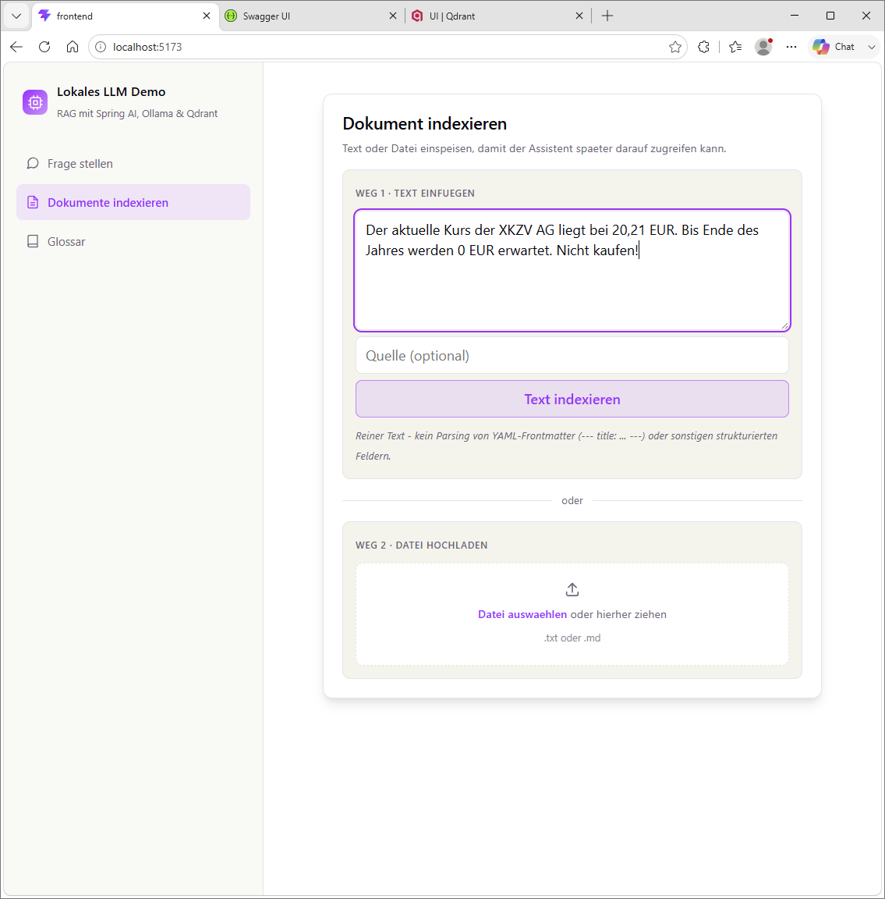
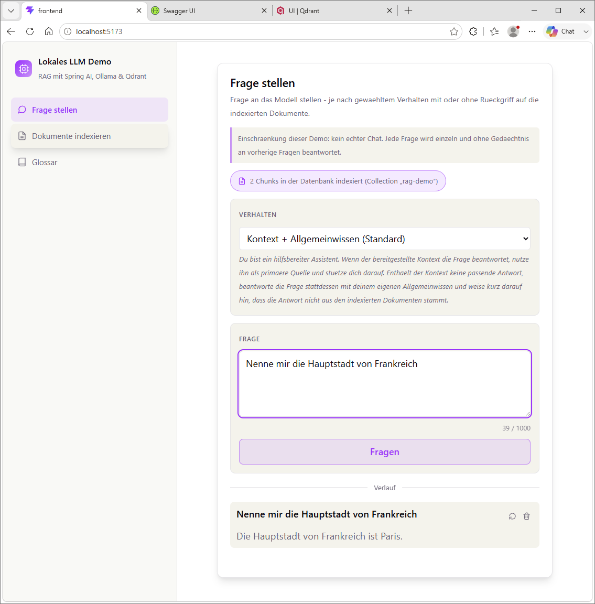
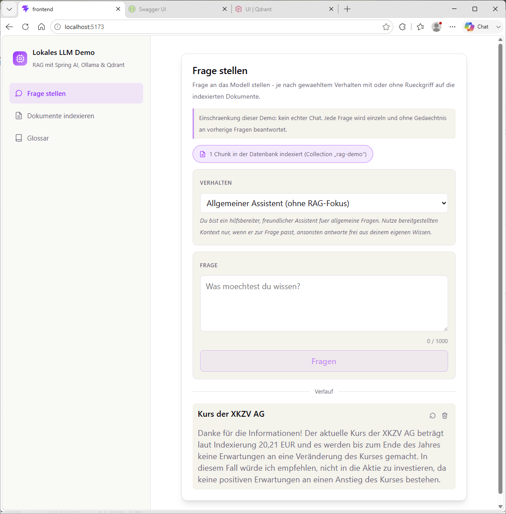

# Kurzanleitung

Voraussetzung: Backend und Frontend laufen (siehe [README](../README.md) fuer
den Start). Backend unter `http://localhost:8080`, Frontend unter
`http://localhost:5173`.

## 1. Dokument indexieren

Unter **"Dokumente indexieren"** einen Text einfuegen (oder eine `.txt`/`.md`-
Datei per Drag & Drop hochladen) und auf **"Text indexieren"** klicken. Der
Text wird in Chunks zerlegt, per Ollama-Embedding-Modell (`mxbai-embed-large`)
vektorisiert und in Qdrant abgelegt.

## 2. Frage stellen

Unter **"Frage stellen"** eine Frage eingeben und auf **"Fragen"** klicken.
Oben laesst sich das **Verhalten** (Persona) auswaehlen - z. B. "Kontext +
Allgemeinwissen", wenn das Modell bei fehlendem Kontext auf sein eigenes
Wissen zurueckfallen soll:

Der Zaehler ("N Chunks in der Datenbank indexiert") zeigt, wie viel aktuell in
Qdrant steckt. Fragt man nach etwas, das gerade indexiert wurde, zieht der
`QuestionAnswerAdvisor` den passenden Chunk als Kontext heran und das Modell
antwortet darauf gestuetzt:

## Was man sonst noch machen kann

- **Verlauf**: jede beantwortete Frage erscheint darunter - per ↺-Icon lässt
  sie sich erneut ins Eingabefeld uebernehmen, per Papierkorb-Icon loeschen.
- **Verhalten wechseln**: vier Personas stehen zur Auswahl (streng/nur
  Kontext, Kontext + Allgemeinwissen, allgemeiner Assistent, knapp & direkt) -
  jede mit eigenem System-Prompt, sichtbar als Hinweistext unter der Auswahl.
  Details dazu im [Glossar](#) (App, Menuepunkt "Glossar") und in der
  [README](../README.md).
- **Swagger UI**: `http://localhost:8080/swagger-ui.html` zum direkten
  Ausprobieren der REST-Endpunkte ohne Frontend.
- **Qdrant-Dashboard**: `http://localhost:6333/dashboard` zeigt die
  tatsaechlich gespeicherten Punkte/Collections.
