# Anleitung: spring-ai-showcase mit Screenshots

Diese Anleitung zeigt die "Signal-Konsole" (Frontend) und alle sechs Kanäle
anhand von Screenshots. Setup-Schritte (Env-Var, Qdrant, Backend, Frontend
starten) stehen ausführlich im [README](../README.md) — hier geht es nur
darum, was man nach dem Start tatsächlich sieht und bedient.

## Patch-Panel (Startseite)

Unter http://localhost:5173 zeigt die Startseite alle sechs Kanäle als
Kacheln. Jede Kachel führt zur zugehörigen Kanal-Seite (`/ch/01`–`/ch/06`):

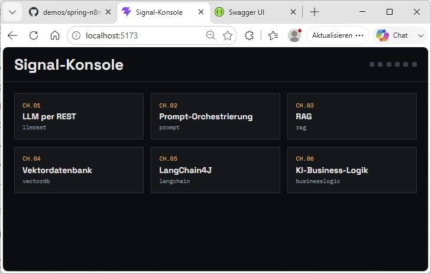

## CH.01 — LLM per REST

Freitext-Prompt eingeben, "Anfrage senden" klicken — das Backend ruft direkt
`POST /chat/completions` bei OpenAI auf und gibt die Antwort aus:

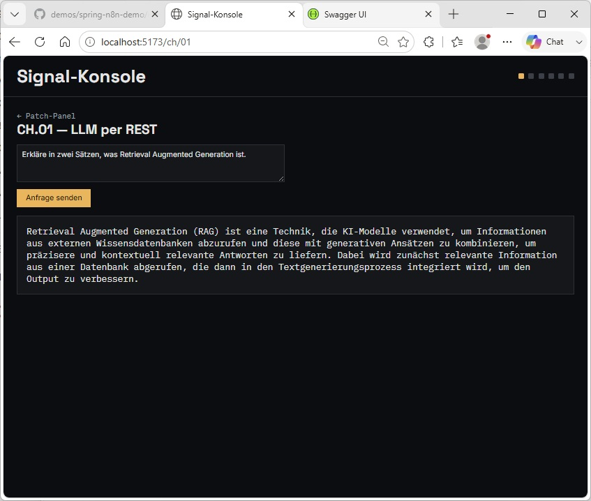

## CH.02 — Prompt-Orchestrierung

Ein Template aus dem Dropdown wählen (Zusammenfassung, Übersetzung DE→EN,
Sentiment-Klassifikation, E-Mail-Antwortentwurf, Stichpunkte extrahieren),
Eingabetext eintragen und senden. Das Template wird serverseitig mit dem
Eingabetext gerendert, bevor es an den Chat-Call geht:

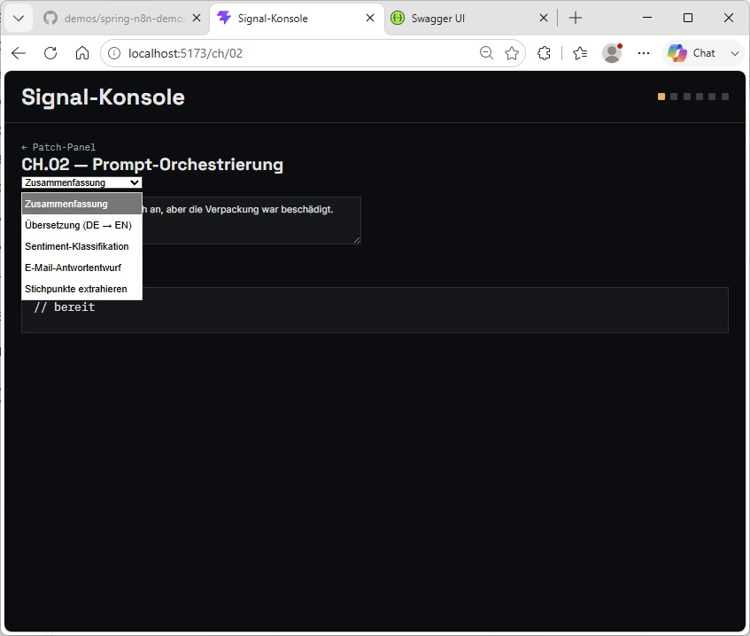

Beispiel "E-Mail-Antwortentwurf" — aus einer Kundenbeschwerde wird ein
vollständiger Antwortentwurf:

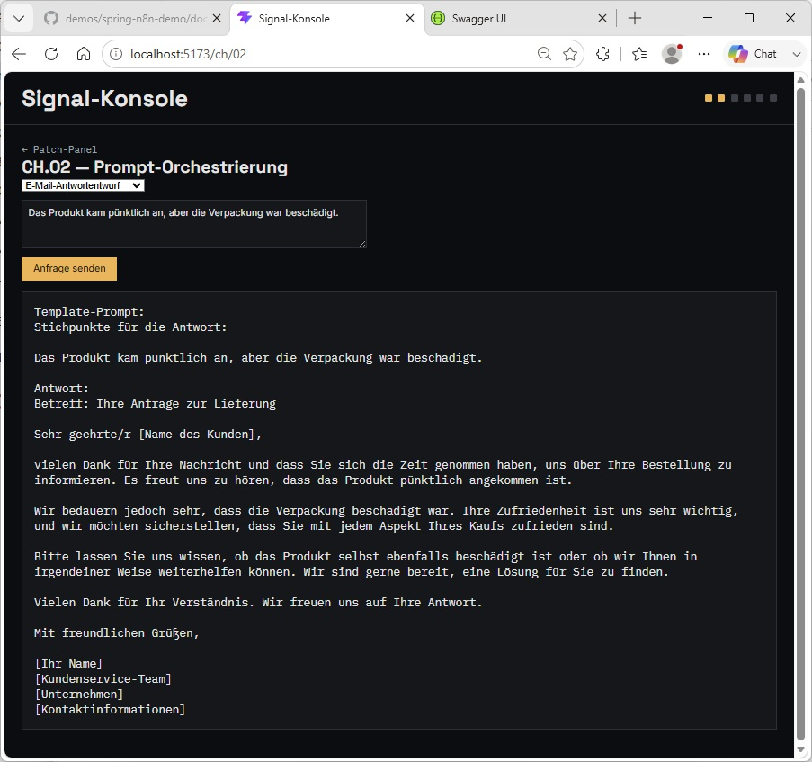

Beispiel "Übersetzung (DE → EN)":

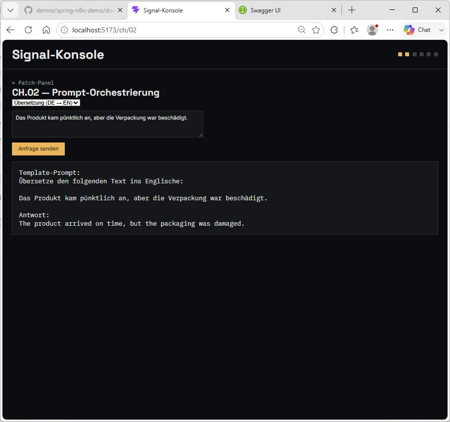

## CH.03 — RAG (Retrieval Augmented Generation)

Frage zur HR-Wissensbasis stellen (Urlaub, Homeoffice, Reisekosten,
IT-Support, Elternzeit, Sabbatical). Die Antwort zeigt zusätzlich, welche
Dokumente als Kontext gefunden und verwendet wurden:

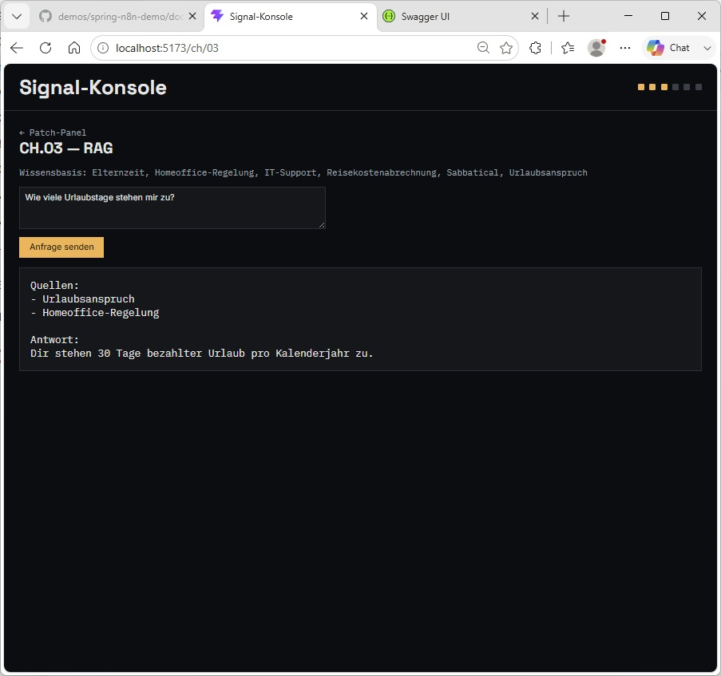

## CH.04 — Vektordatenbank (Qdrant)

Erst "Dokumente indexieren", danach eine Suchanfrage stellen. Anders als
CH.03 läuft die Suche gegen den persistenten Qdrant-Store und liefert nur
Treffer mit Score zurück — keine generierte Antwort:

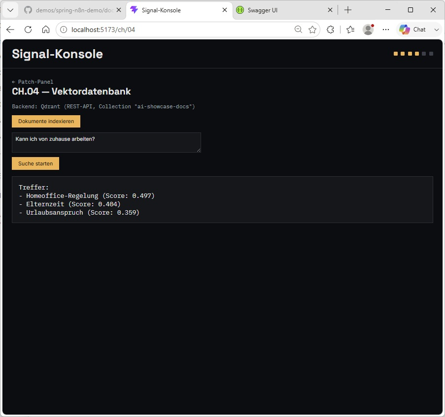

## CH.05 — LangChain4J mit Session-Memory

Ein Chat mit fortlaufendem Verlauf pro Browser-Session
(`crypto.randomUUID()`). Das Modell erinnert sich innerhalb der Session an
vorher genannte Informationen:

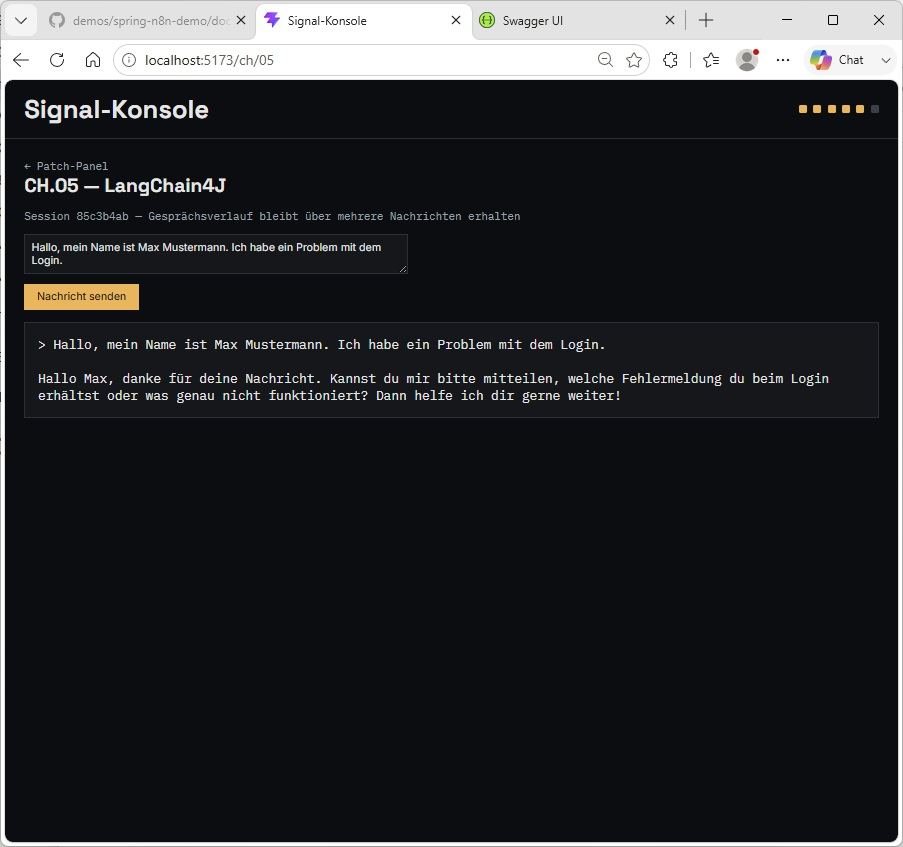

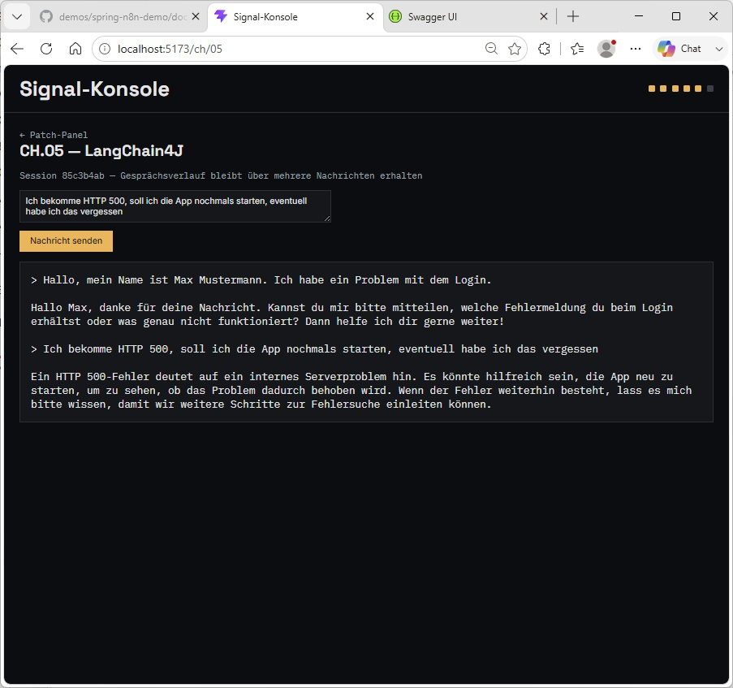

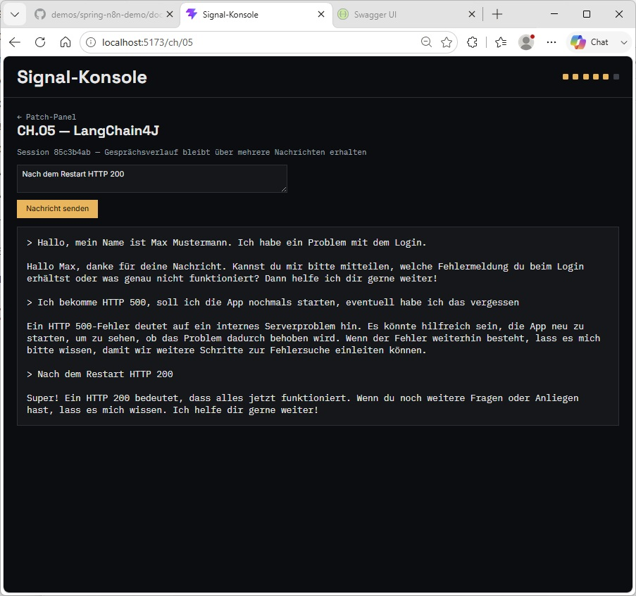

## CH.06 — KI-Business-Logik (Ticket-Triage)

Ticket-Text eingeben und klassifizieren lassen. Das Backend fragt OpenAI im
JSON-Mode ab und liefert Kategorie, Priorität, Zusammenfassung und
Antwortentwurf in einer Antwort:

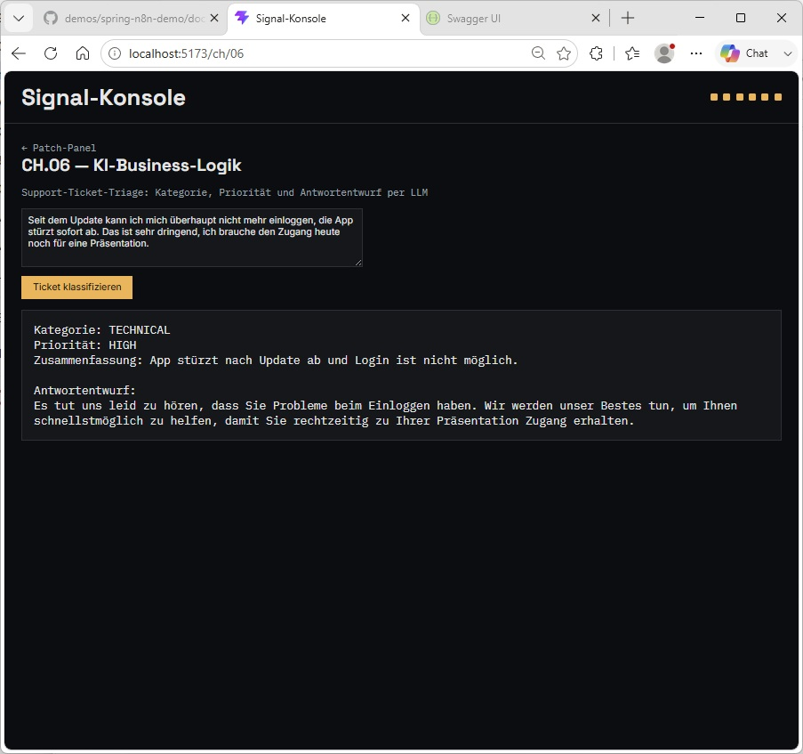