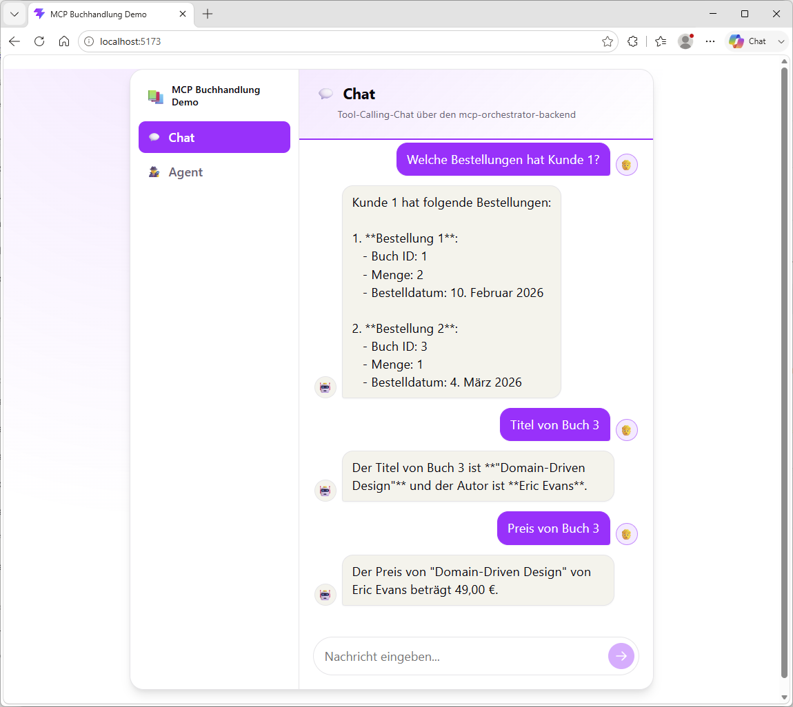
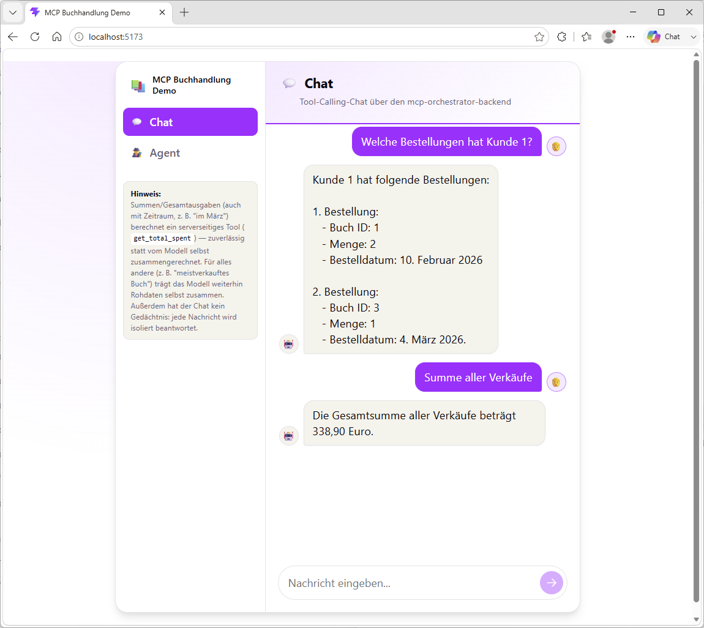
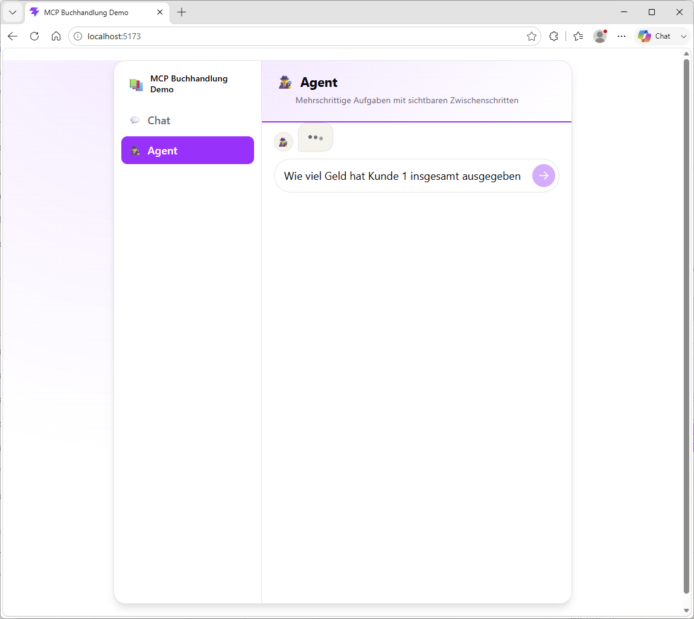
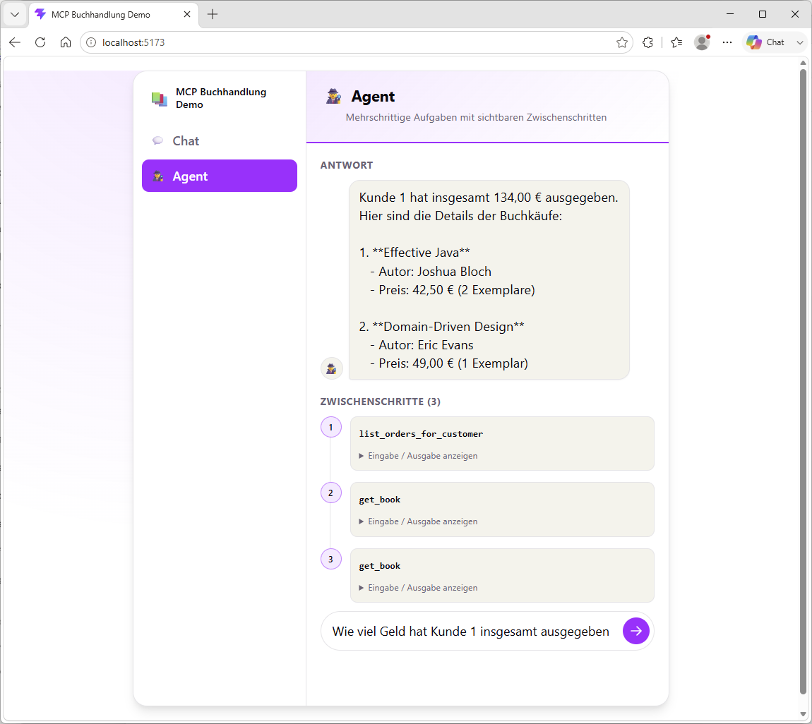
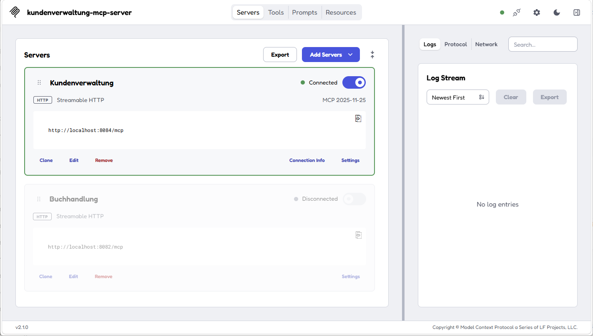
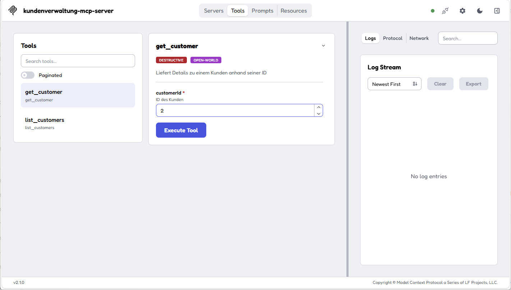
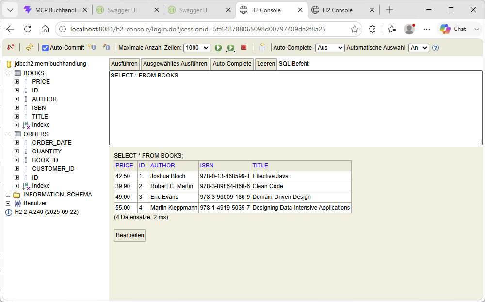
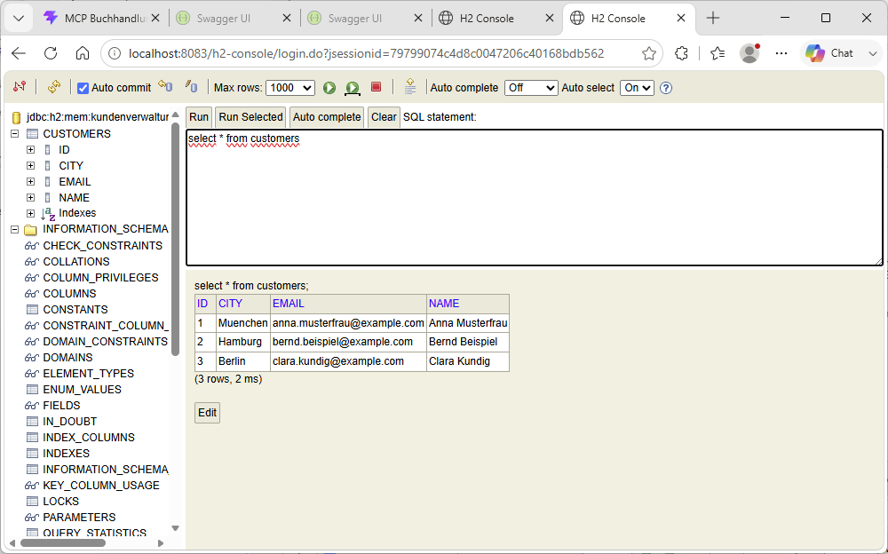

# Kurzanleitung

Voraussetzung: alle Backends und das Frontend laufen (Start-Reihenfolge siehe
[README](../README.md)). Frontend unter `http://localhost:5173`.

## 1. Chat (Tool-Calling)

In der Sidebar **"Chat"** auswählen und eine Frage zu Büchern, Bestellungen
oder Kunden eingeben. Das Modell entscheidet selbst, welche MCP-Tools es dafür
braucht (`list_books`, `get_book`, `list_orders_for_customer`,
`list_customers`, `get_customer`) und ruft sie im Hintergrund auf:

## 2. Zahlen- und Summenfragen

Für Summen/Gesamtausgaben (auch mit Zeitraum) gibt es ein eigenes,
serverseitiges Tool (`get_total_spent`), das die Summe deterministisch
berechnet statt sie dem Modell zu überlassen — der Hinweis dazu steht direkt
unter den Menüpunkten in der Sidebar:

## 3. Agent-Modus (mehrschrittig, mit sichtbaren Zwischenschritten)

Unter **"Agent"** lassen sich mehrschrittige, auch domänenübergreifende
Aufgaben stellen. Der Agent zerlegt die Aufgabe in einzelne Tool-Aufrufe und
zeigt sie als Timeline an — hier z. B. `list_orders_for_customer` gefolgt von
zwei `get_book`-Aufrufen, um Bestellungen und Buchpreise zusammenzuführen
(für reine Summenfragen wird inzwischen bevorzugt das Tool `get_total_spent`
aus Punkt 2 genutzt):

Jeder Schritt lässt sich über "Eingabe / Ausgabe anzeigen" aufklappen, um die
rohen Tool-Ergebnisse zu sehen — das ist auch der einzige Weg, eine Antwort
gegen die tatsächlich genutzten Daten zu prüfen, statt dem Fließtext blind zu
vertrauen.

## 4. MCP Inspector (Tools unabhängig vom Frontend testen)

Der [MCP Inspector](https://github.com/modelcontextprotocol/inspector) verbindet
sich direkt mit einem einzelnen mcp-server (ohne Orchestrator/LLM dazwischen)
und zeigt alle Tools mit ihrem generierten JSON-Schema:

Details zum Starten und Verbinden: siehe
[README, Abschnitt "MCP Inspector"](../README.md#mcp-inspector-tools-manuell-testen).

## 5. H2-Console (Rohdaten direkt einsehen)

Unter `http://localhost:8081/h2-console` (Buchhandlung) bzw.
`http://localhost:8083/h2-console` (Kundenverwaltung) lässt sich die jeweilige
In-Memory-Datenbank direkt per SQL abfragen — z. B. um eine Chat-/Agent-Antwort
gegen die tatsächlichen Rohdaten zu prüfen. Wichtig beim Login: die JDBC-URL
auf `jdbc:h2:mem:buchhandlung` bzw. `jdbc:h2:mem:kundenverwaltung` setzen
(User `sa`, Passwort leer) — sonst verbindet die Console mit einer neuen,
leeren Datenbank statt mit den laufenden Seed-Daten:

## Was man sonst noch machen kann

- **Swagger UI** je REST-API: siehe [URL-Übersicht in der README](../README.md#url-übersicht).
- **Architektur/Entscheidungen im Detail**: siehe
  [MCP-Spring-Demo-Konzept.md](MCP-Spring-Demo-Konzept.md).
