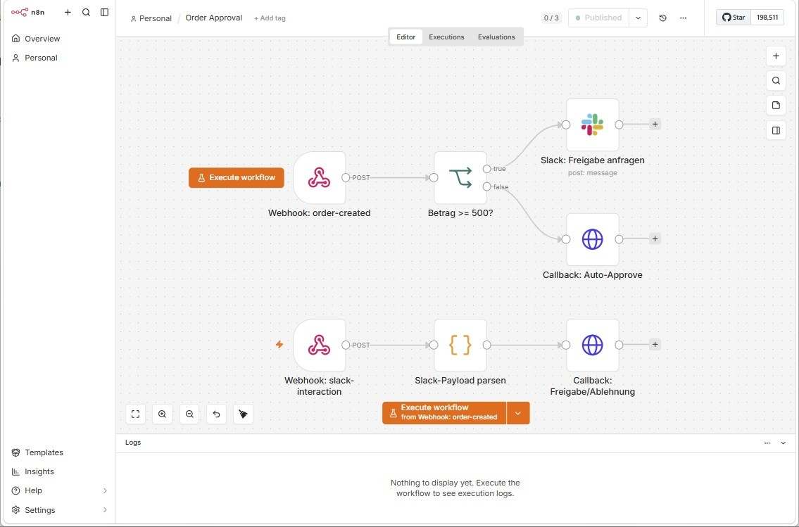
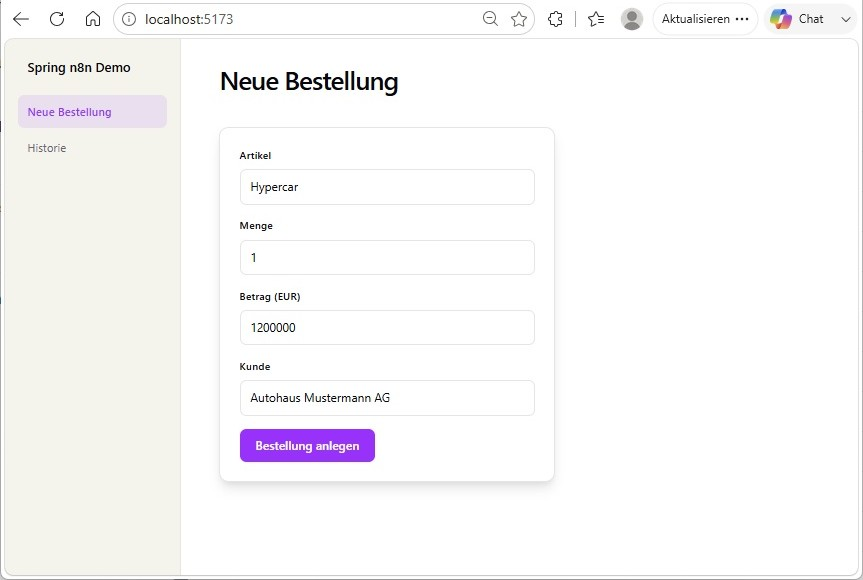
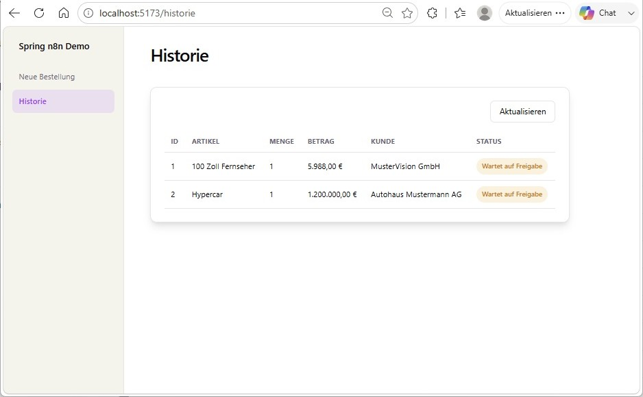
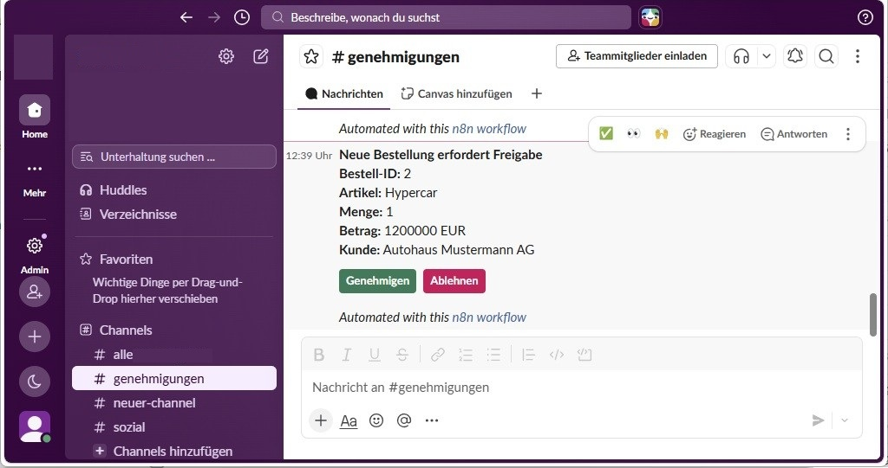
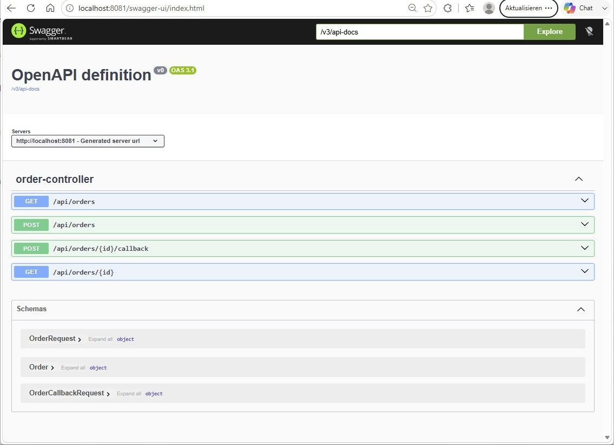

# Anleitung: spring-n8n-demo lokal ausführen

Diese Anleitung richtet sich an alle, die die Demo auf ihrem eigenen Rechner
aufsetzen und ausprobieren möchten. Sie erklärt kurz die Funktionsweise der
einzelnen Komponenten und führt Schritt für Schritt durch Start, Nutzung und
Aufräumen.

## Was macht die Demo?

Ein Bestell-Prozess mit drei Komponenten, die zusammenspielen:

```
Frontend (React) → Backend (Spring Boot) → Webhook → n8n → Slack-Nachricht
                                                    ↘ (< 500 EUR) Auto-Approve-Callback → Backend

Slack-Button (Genehmigen/Ablehnen) → n8n-Webhook (slack-interaction) → Callback → Backend
```

- **Frontend**: React-SPA, in der man Bestellungen anlegt und die Historie
  mit Status einsehen kann. Spricht nur mit dem Backend, kennt n8n und Slack
  nicht.
- **Backend**: Spring Boot REST-API. Verwaltet die Bestellungen (H2-Datenbank
  im Speicher) und stößt bei jeder neuen Bestellung einen Webhook in n8n an.
  Bietet zusätzlich den Callback-Endpunkt, über den eine Freigabe-Entscheidung
  gesetzt wird.
- **n8n**: Workflow-Automatisierung. Prüft den Bestellbetrag: liegt er unter
  500 EUR, ruft n8n direkt den Callback mit `APPROVED` auf. Ab 500 EUR postet
  n8n stattdessen eine Nachricht mit zwei Buttons ("Genehmigen"/"Ablehnen") in
  den Slack-Channel `#genehmigungen`. Ein zweiter Webhook
  (`slack-interaction`) nimmt Klicks auf diese Buttons entgegen, liest die
  Entscheidung aus dem Slack-Payload und ruft damit ebenfalls den
  Callback-Endpunkt am Backend auf.

## Der n8n-Workflow im Detail



Der Workflow "Order Approval" besteht aus zwei Strängen:

- **Oben**: `Webhook: order-created` → `Betrag >= 500?` → entweder
  `Slack: Freigabe anfragen` (Betrag hoch) oder `Callback: Auto-Approve`
  (Betrag niedrig).
- **Unten**: `Webhook: slack-interaction` → `Slack-Payload parsen` →
  `Callback: Freigabe/Ablehnung`. Dieser Strang wird ausgelöst, sobald jemand
  in Slack auf "Genehmigen" oder "Ablehnen" klickt.

## Voraussetzungen

- Java 21, Maven (Wrapper `mvnw` ist im Projekt enthalten)
- Node.js 22+
- Docker Desktop

## Demo starten

**1. n8n starten**

```bash
docker compose up -d
```

n8n ist danach unter http://localhost:5678 erreichbar. Beim allerersten
Start muss der Workflow importiert werden:

```bash
docker cp docs/n8n-order-approval-workflow.json spring-n8n-demo-n8n:/tmp/workflow.json
docker exec spring-n8n-demo-n8n n8n import:workflow --input=/tmp/workflow.json
docker exec spring-n8n-demo-n8n n8n publish:workflow --id=orderApproval1
docker restart spring-n8n-demo-n8n
```

Danach in der n8n-UI unter **Credentials** ein Slack-API-Credential mit
Bot-Token anlegen und im Workflow-Node "Slack: Freigabe anfragen" zuweisen
(siehe [anforderungen.md](anforderungen.md) für Details zur
Slack-App-Einrichtung).

**2. Backend starten**

```bash
cd backend
./mvnw spring-boot:run
```

Läuft auf http://localhost:8081.

**3. Frontend starten**

```bash
cd frontend
npm install
npm run dev
```

Läuft auf http://localhost:5173.

## Demo benutzen

**Bestellung anlegen**

Im Frontend unter "Neue Bestellung" ein Formular ausfüllen und absenden:



**Historie einsehen**

Unter "Historie" sieht man alle Bestellungen mit ihrem aktuellen Status
(z.B. "Wartet auf Freigabe" bei Beträgen ab 500 EUR):



**Freigabe-Nachricht in Slack**

Liegt der Betrag über 500 EUR, postet n8n automatisch eine Nachricht mit
Bestelldetails und den Buttons "Genehmigen"/"Ablehnen" in `#genehmigungen`:



Ohne öffentlich erreichbaren Tunnel zu n8n (siehe
[Erweiterungen in anforderungen.md](anforderungen.md#erweiterungen)) kann
Slack den Klick auf diese Buttons nicht zustellen. Die Freigabe erfolgt in
diesem Fall über die Swagger UI, siehe nächster Abschnitt.

## Swagger UI

Unter **http://localhost:8081/swagger-ui.html** stellt das Backend eine
interaktive OpenAPI-Oberfläche bereit, über die sich alle REST-Endpunkte
direkt im Browser aufrufen lassen — praktisch, um die API ohne Frontend zu
erkunden oder Freigaben manuell zu setzen:



Relevant für die Freigabe ist `POST /api/orders/{id}/callback`: Node
aufklappen, "Try it out" klicken, die Bestell-ID eintragen und als Body
`{"decision":"APPROVED"}` oder `{"decision":"REJECTED"}` senden. Die
Historie im Frontend zeigt danach den aktualisierten Status.

## Demo beenden und aufräumen

```bash
# Frontend: im jeweiligen Terminal mit Strg+C stoppen
# Backend: im jeweiligen Terminal mit Strg+C stoppen

# n8n-Container stoppen
docker compose down
```

`docker compose down` entfernt den Container, das Docker-Volume
`n8n-data` (und damit der importierte Workflow samt Slack-Credential)
bleibt erhalten. Nur `docker compose down -v` löscht auch das Volume — dann
muss der Workflow beim nächsten Start erneut importiert werden.
