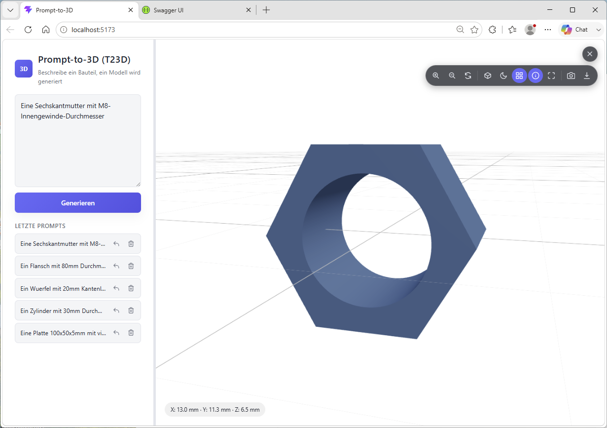

# Anleitung: Prompt-to-3D (T23D)

Links wird ein Bauteil per Text beschrieben, rechts erscheint das daraus
generierte 3D-Modell in einem interaktiven Viewer.

## Prompt-Bereich (links)

Im Textfeld wird das gewünschte Bauteil beschrieben (z. B. "Eine
Sechskantmutter mit M8-Innengewinde-Durchmesser") und über **Generieren**
an das Backend geschickt. Unter **Letzte Prompts** stehen einige
Beispiel-Prompts direkt zur Auswahl bereit — diese Vorbelegung liegt in
`frontend/src/data/examplePrompts.json` und kann dort unabhängig vom Code
gepflegt werden. Jeder Eintrag in der Historie hat zwei Icons:

- ↩ **Übernehmen** — übernimmt den Prompt-Text ins Eingabefeld
- 🗑 **Löschen** — entfernt den Eintrag aus der Historie

Die Breite des Prompt-Bereichs lässt sich über den Splitter (Trennlinie
zum Viewer) per Ziehen anpassen.

## 3D-Viewer (rechts)

Nach der Generierung passt sich die Kamera automatisch an die Größe des
Modells an, unabhängig davon, ob ein sehr kleines oder sehr großes Bauteil
erzeugt wurde. Die Werkzeugleiste oben rechts bietet:

- **Vergrößern/Verkleinern/Ansicht zurücksetzen**
- **Drahtgitter** umschalten
- **Hintergrund** umschalten (Schwarz/Weiß, Standard: Weiß)
- **Gitter** ein-/ausblenden — praktisch, um es vor einem Screenshot
  auszublenden
- **Maße anzeigen** — blendet die Abmessungen (X/Y/Z in mm) des Modells
  unten links ein, Standard: eingeblendet
- **Vollbild**
- **Screenshot speichern** — lädt den aktuellen Viewer-Inhalt als PNG
  herunter
- **STL herunterladen** — lädt die generierte STL-Datei herunter

## Weitere Infos

Setup und Start von Backend/Frontend: siehe [../README.md](../README.md).
Architektur- und Konzeptdetails: siehe [01-anforderungen.md](01-anforderungen.md).
