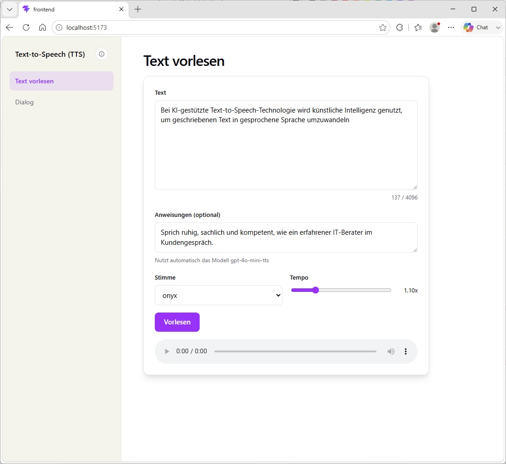
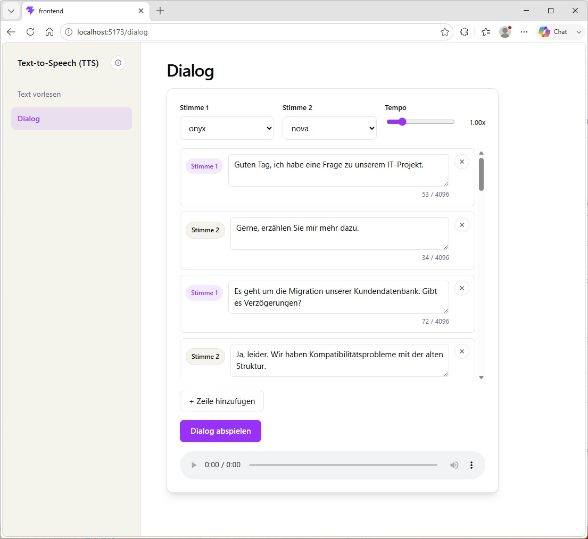

# Anleitung: Text-to-Speech Demo

**TTS** steht für **Text-to-Speech** (Text-zu-Sprache). Bei **AI TTS** wandelt
künstliche Intelligenz geschriebenen Text in gesprochene Sprache um – meist
mit sehr natürlich klingenden, menschenähnlichen Stimmen. Diese Demo nutzt
dafür die Text-to-Speech-API von OpenAI über ein Spring-Backend.

Das Frontend bietet zwei Anwendungsfälle in der Sidebar: **Text vorlesen**
und **Dialog**.

## Text vorlesen

Einzelnen Text in Sprache umwandeln. Neben dem Text lassen sich optionale
**Anweisungen** zu Tonfall/Emotion angeben (z. B. "sprich ruhig und
kompetent") – sobald Anweisungen gesetzt sind, wechselt das Backend
automatisch auf das Modell `gpt-4o-mini-tts`, da nur dieses Anweisungen
unterstützt. Dazu wählbar: **Stimme** und **Tempo** (0,25x–4x). Ein
Zeichenzähler unter dem Textfeld zeigt die Auslastung des 4096-Zeichen-Limits
von OpenAI an. Das erzeugte Audio wird direkt im eingebetteten Player
abgespielt.

## Dialog

Ein Gespräch zwischen zwei Stimmen nachbilden. **Stimme 1** und **Stimme 2**
sowie ein gemeinsames **Tempo** werden einmal festgelegt; darunter steht ein
"Stack" aus Dialogzeilen, die abwechselnd Stimme 1 und Stimme 2 zugeordnet
sind (Zeilen lassen sich hinzufügen, bearbeiten und entfernen, jeweils mit
Zeichenzähler). Die Vorbelegung des Stacks liegt in
`frontend/src/data/dialogPreset.json` und kann dort unabhängig vom Code
gepflegt werden.

**Dialog abspielen** synthetisiert und spielt die Zeilen nacheinander ab; die
gerade aktive Zeile wird hervorgehoben. Über **Stop** lässt sich die
Wiedergabe jederzeit sofort abbrechen.

## Weitere Infos

Setup und Start von Backend/Frontend: siehe [../README.md](../README.md).
Architektur- und Konzeptdetails: siehe [anforderungen.md](anforderungen.md).
